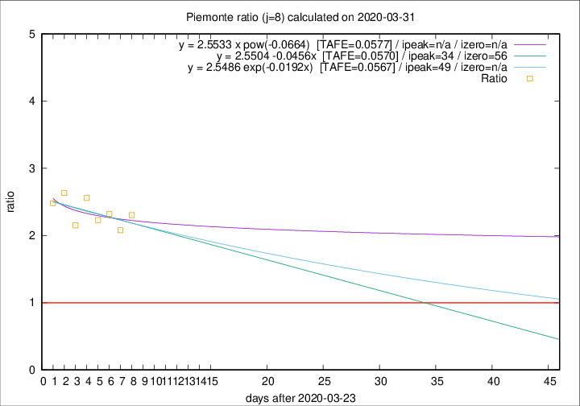

# Piemonte

Data source: https://raw.githubusercontent.com/pcm-dpc/COVID-19/master/dati-json/dpc-covid19-ita-regioni.json

Delta days analysis (j): 8

## Fitting 
|fit type|best fit equation|tafe|tfe|ipeak|izero|
|-------|-----|--------|------|---|---|
|linear|y = 2.5504 -0.0456x  [TAFE=0.0570]|0.0570|0.0041|34|56|
|exp|y = 2.5486 exp(-0.0192x)  [TAFE=0.0567]|0.0567|0.0019|49|n/a|
|pow|y = 2.5533 x pow(-0.0664)  [TAFE=0.0577]|0.0577|0.0021|n/a|n/a|

## Data
|Date|Daily deaths|Cumulated deaths|Deaths in the last 8 days|Deaths in the 8 days before|ratio|
|----|----------|-----------|-------|--------------------|-----|
|2020-03-31|105|854|539|234|2.3034|
|2020-03-30|65|749|466|224|2.0804|
|2020-03-29|67|684|446|192|2.3229|
|2020-03-28|48|617|408|183|2.2295|
|2020-03-27|120|569|394|154|2.5584|
|2020-03-26|0|449|295|137|2.1533|
|2020-03-25|75|449|316|120|2.6333|
|2020-03-24|59|374|263|106|2.4811|

[Download data as CSV](COVID-19_piemonte_j8_2020-03-31.csv)

Generated April 8th, 2020 at 23:43:36 UTC+0200 with https://github.com/robianc/COVID-19
