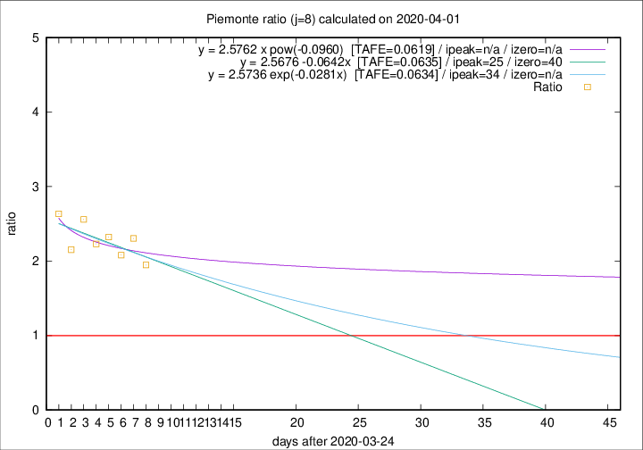

# Piemonte

Data source: https://raw.githubusercontent.com/pcm-dpc/COVID-19/master/dati-json/dpc-covid19-ita-regioni.json

Delta days analysis (j): 8

Analyses for other values of j for 2020-04-01 are avalable [here](../README.md)

Analyses for Piemonte for previous dates are avalable [here](../../README.md)

## Fitting 
|fit type|best fit equation|tafe|tfe|ipeak|izero|
|-------|-----|--------|------|---|---|
|linear|y = 2.5676 -0.0642x  [TAFE=0.0635]|0.0635|0.0049|25|40|
|exp|y = 2.5736 exp(-0.0281x)  [TAFE=0.0634]|0.0634|0.0022|34|n/a|
|pow|y = 2.5762 x pow(-0.0960)  [TAFE=0.0619]|0.0619|0.0025|n/a|n/a|

## Data
|Date|Daily deaths|Cumulated deaths|Deaths in the last 8 days|Deaths in the 8 days before|ratio|
|----|----------|-----------|-------|--------------------|-----|
|2020-04-01|32|886|512|263|1.9468|
|2020-03-31|105|854|539|234|2.3034|
|2020-03-30|65|749|466|224|2.0804|
|2020-03-29|67|684|446|192|2.3229|
|2020-03-28|48|617|408|183|2.2295|
|2020-03-27|120|569|394|154|2.5584|
|2020-03-26|0|449|295|137|2.1533|
|2020-03-25|75|449|316|120|2.6333|

[Download data as CSV](COVID-19_piemonte_j8_2020-04-01.csv)

Generated April 10th, 2020 at 17:26:10 UTC+0200 with https://github.com/robianc/COVID-19
