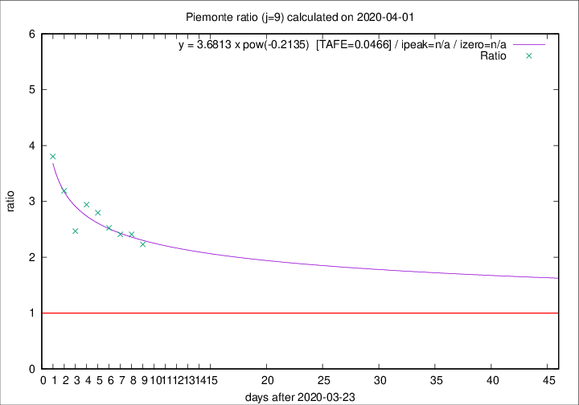

# Piemonte

Data source: https://raw.githubusercontent.com/pcm-dpc/COVID-19/master/dati-json/dpc-covid19-ita-regioni.json

Estimates in this page were made on 19/4/2020 with data available until 01/04/2020.

## Summary 

### Peak estimate 
|j|linear [TAFE]|exponential [TAFE]|power law [TAFE]|details|
|---|----|-----------|---------|-------|
|7|18/4/2020 [TAFE=0.0946]|21/4/2020 [TAFE=0.0976]|-|[analysis](COVID-19_piemonte_j7_2020-04-01.md)|
|8|19/4/2020 [TAFE=0.0635]|28/4/2020 [TAFE=0.0634]|-|[analysis](COVID-19_piemonte_j8_2020-04-01.md)|
|9|10/4/2020 [TAFE=0.0580]|17/4/2020 [TAFE=0.0538]|-|[analysis](COVID-19_piemonte_j9_2020-04-01.md)|
|10|6/4/2020 [TAFE=0.1063]|12/4/2020 [TAFE=0.0821]|-|[analysis](COVID-19_piemonte_j10_2020-04-01.md)|
|11|3/4/2020 [TAFE=0.2600]|9/4/2020 [TAFE=0.1372]|18/5/2020 [TAFE=0.0704]|[analysis](COVID-19_piemonte_j11_2020-04-01.md)|
|12|3/4/2020 [TAFE=0.2481]|9/4/2020 [TAFE=0.1083]|1/6/2020 [TAFE=0.1540]|[analysis](COVID-19_piemonte_j12_2020-04-01.md)|
|13|-|-|-||
|14|-|-|-||

Best estimator is exp with j=9 (TAFE=0.0538)
Corresponding peak date estimate is 17/4/2020 (ipeak 24)

Peak date range estimate: 24/3/2020 - 4/6/2020

### End estimate 
|j|linear [TAFE/TFE]|exponential [TAFE/TFE]|power law [TAFE/TFE]|details|
|---|----|-----------|---------|-------|
|7|6/5/2020 [TAFE=0.0946]|-|-|[analysis](COVID-19_piemonte_j7_2020-04-01.md)|
|8|4/5/2020 [TAFE=0.0635]|-|-|[analysis](COVID-19_piemonte_j8_2020-04-01.md)|
|9|17/4/2020 [TAFE=0.0580]|-|-|[analysis](COVID-19_piemonte_j9_2020-04-01.md)|
|10|-|-|-|[analysis](COVID-19_piemonte_j10_2020-04-01.md)|
|11|-|-|-|[analysis](COVID-19_piemonte_j11_2020-04-01.md)|
|12|-|-|-|[analysis](COVID-19_piemonte_j12_2020-04-01.md)|
|13|-|-|-||
|14|-|-|-||

Best estimator is linear with j=9 (TAFE=0.0580)
Corresponding end date estimate is 17/4/2020 (izero 24)

End date range estimate: 24/3/2020 - 4/5/2020

Generated April 19th, 2020 at 18:42:39 UTC+0200 with https://github.com/robianc/COVID-19
