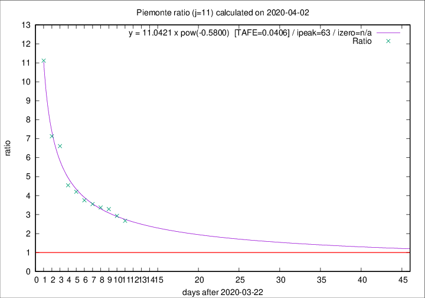

# Piemonte

Data source: https://raw.githubusercontent.com/pcm-dpc/COVID-19/master/dati-json/dpc-covid19-ita-regioni.json

Delta days analysis (j): 11

Analyses for other values of j for 2020-04-02 are avalable [here](../README.md)

Analyses for Piemonte for previous dates are avalable [here](../../README.md)

## Fitting 
|fit type|best fit equation|tafe|tfe|ipeak|izero|
|-------|-----|--------|------|---|---|
|pow|y = 11.0421 x pow(-0.5800)  [TAFE=0.0406]|0.0406|0.0014|63|n/a|

## Data
|Date|Daily deaths|Cumulated deaths|Deaths in the last 11 days|Deaths in the 11 days before|ratio|
|----|----------|-----------|-------|--------------------|-----|
|2020-04-02|97|983|700|262|2.6718|
|2020-04-01|32|886|648|221|2.9321|
|2020-03-31|105|854|645|196|3.2908|
|2020-03-30|65|749|574|170|3.3765|
|2020-03-29|67|684|530|149|3.5570|
|2020-03-28|48|617|484|129|3.7519|
|2020-03-27|120|569|458|109|4.2018|
|2020-03-26|0|449|368|81|4.5432|
|2020-03-25|75|449|390|59|6.6102|
|2020-03-24|59|374|328|46|7.1304|
|2020-03-23|32|315|289|26|11.1154|

[Download data as CSV](COVID-19_piemonte_j11_2020-04-02.csv)

Generated April 12th, 2020 at 16:28:18 UTC+0200 with https://github.com/robianc/COVID-19
