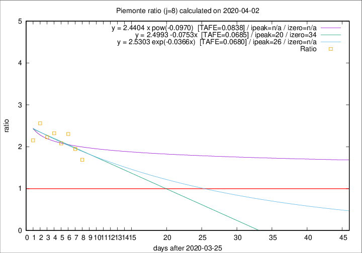

# Piemonte

Data source: https://raw.githubusercontent.com/pcm-dpc/COVID-19/master/dati-json/dpc-covid19-ita-regioni.json

Delta days analysis (j): 8

Analyses for other values of j for 2020-04-02 are avalable [here](../2020-04-02/README.md)

Analyses for Piemonte for previous dates are avalable [here](../README.md)

## Fitting 
|fit type|best fit equation|tafe|tfe|ipeak|izero|
|-------|-----|--------|------|---|---|
|linear|y = 2.4993 -0.0753x  [TAFE=0.0685]|0.0685|0.0068|20|34|
|exp|y = 2.5303 exp(-0.0366x)  [TAFE=0.0680]|0.0680|0.0035|26|n/a|
|pow|y = 2.4404 x pow(-0.0970)  [TAFE=0.0838]|0.0838|0.0050|n/a|n/a|

## Data
|Date|Daily deaths|Cumulated deaths|Deaths in the last 8 days|Deaths in the 8 days before|ratio|
|----|----------|-----------|-------|--------------------|-----|
|2020-04-02|97|983|534|316|1.6899|
|2020-04-01|32|886|512|263|1.9468|
|2020-03-31|105|854|539|234|2.3034|
|2020-03-30|65|749|466|224|2.0804|
|2020-03-29|67|684|446|192|2.3229|
|2020-03-28|48|617|408|183|2.2295|
|2020-03-27|120|569|394|154|2.5584|
|2020-03-26|0|449|295|137|2.1533|

[Download data as CSV](COVID-19_piemonte_j8_2020-04-02.csv)

Generated April 14th, 2020 at 19:16:04 UTC+0200 with https://github.com/robianc/COVID-19
