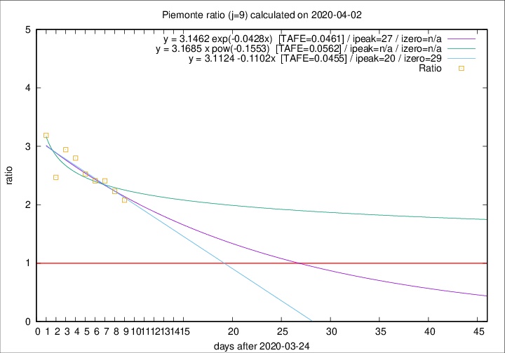

# Piemonte

Data source: https://raw.githubusercontent.com/pcm-dpc/COVID-19/master/dati-json/dpc-covid19-ita-regioni.json

Delta days analysis (j): 9

Analyses for other values of j for 2020-04-02 are avalable [here](../README.md)

Analyses for Piemonte for previous dates are avalable [here](../../README.md)

## Fitting 
|fit type|best fit equation|tafe|tfe|ipeak|izero|
|-------|-----|--------|------|---|---|
|linear|y = 3.1124 -0.1102x  [TAFE=0.0455]|0.0455|0.0040|20|29|
|exp|y = 3.1462 exp(-0.0428x)  [TAFE=0.0461]|0.0461|0.0019|27|n/a|
|pow|y = 3.1685 x pow(-0.1553)  [TAFE=0.0562]|0.0562|0.0026|n/a|n/a|

## Data
|Date|Daily deaths|Cumulated deaths|Deaths in the last 9 days|Deaths in the 9 days before|ratio|
|----|----------|-----------|-------|--------------------|-----|
|2020-04-02|97|983|609|293|2.0785|
|2020-04-01|32|886|571|256|2.2305|
|2020-03-31|105|854|571|237|2.4093|
|2020-03-30|65|749|511|212|2.4104|
|2020-03-29|67|684|475|188|2.5266|
|2020-03-28|48|617|442|158|2.7975|
|2020-03-27|120|569|415|141|2.9433|
|2020-03-26|0|449|316|128|2.4688|
|2020-03-25|75|449|338|106|3.1887|

[Download data as CSV](COVID-19_piemonte_j9_2020-04-02.csv)

Generated April 12th, 2020 at 16:28:18 UTC+0200 with https://github.com/robianc/COVID-19
