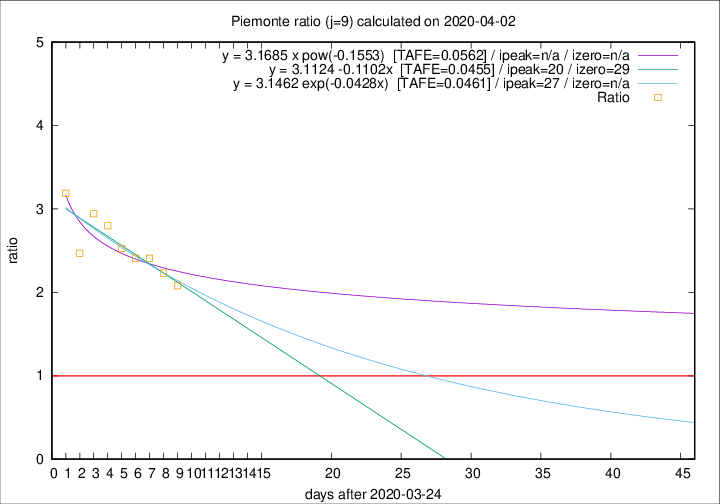

# Piemonte

Data source: https://raw.githubusercontent.com/pcm-dpc/COVID-19/master/dati-json/dpc-covid19-ita-regioni.json

Estimates in this page were made on 8/4/2020 with data available until 02/04/2020.

## Summary 

### Peak estimate 
|j|linear [TAFE]|exponential [TAFE]|power law [TAFE]|details|
|---|----|-----------|---------|-------|
|7|14/4/2020 [TAFE=0.0698]|18/4/2020 [TAFE=0.0699]|-|[analysis](COVID-19_piemonte_j7_2020-04-02.md)|
|8|15/4/2020 [TAFE=0.0685]|21/4/2020 [TAFE=0.0680]|-|[analysis](COVID-19_piemonte_j8_2020-04-02.md)|
|9|14/4/2020 [TAFE=0.0455]|21/4/2020 [TAFE=0.0461]|-|[analysis](COVID-19_piemonte_j9_2020-04-02.md)|
|10|7/4/2020 [TAFE=0.0998]|14/4/2020 [TAFE=0.0846]|-|[analysis](COVID-19_piemonte_j10_2020-04-02.md)|
|11|4/4/2020 [TAFE=0.2087]|11/4/2020 [TAFE=0.1168]|25/5/2020 [TAFE=0.0406]|[analysis](COVID-19_piemonte_j11_2020-04-02.md)|
|12|3/4/2020 [TAFE=0.2833]|10/4/2020 [TAFE=0.1323]|26/5/2020 [TAFE=0.1133]|[analysis](COVID-19_piemonte_j12_2020-04-02.md)|
|13|2/4/2020 [TAFE=0.4981]|9/4/2020 [TAFE=0.1672]|15/5/2020 [TAFE=0.1208]|[analysis](COVID-19_piemonte_j13_2020-04-02.md)|
|14|-|-|-||

Best estimator is pow with j=11 (TAFE=0.0406)
Corresponding peak date estimate is 25/5/2020 (ipeak 63)

Peak date range estimate: 23/3/2020 - 27/5/2020

### End estimate 
|j|linear [TAFE/TFE]|exponential [TAFE/TFE]|power law [TAFE/TFE]|details|
|---|----|-----------|---------|-------|
|7|28/4/2020 [TAFE=0.0698]|-|-|[analysis](COVID-19_piemonte_j7_2020-04-02.md)|
|8|29/4/2020 [TAFE=0.0685]|-|-|[analysis](COVID-19_piemonte_j8_2020-04-02.md)|
|9|23/4/2020 [TAFE=0.0455]|-|-|[analysis](COVID-19_piemonte_j9_2020-04-02.md)|
|10|-|-|-|[analysis](COVID-19_piemonte_j10_2020-04-02.md)|
|11|-|-|-|[analysis](COVID-19_piemonte_j11_2020-04-02.md)|
|12|-|-|-|[analysis](COVID-19_piemonte_j12_2020-04-02.md)|
|13|-|-|-|[analysis](COVID-19_piemonte_j13_2020-04-02.md)|
|14|-|-|-||

Best estimator is linear with j=9 (TAFE=0.0455)
Corresponding end date estimate is 23/4/2020 (izero 29)

End date range estimate: 25/3/2020 - 28/4/2020

Generated April 8th, 2020 at 23:43:36 UTC+0200 with https://github.com/robianc/COVID-19
