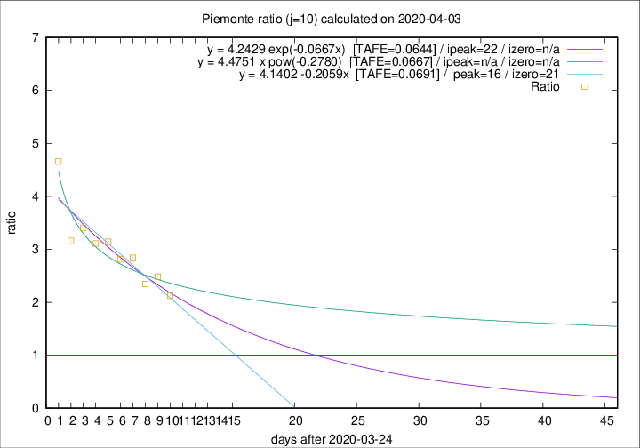

# Piemonte

Data source: https://raw.githubusercontent.com/pcm-dpc/COVID-19/master/dati-json/dpc-covid19-ita-regioni.json

Delta days analysis (j): 10

Analyses for other values of j for 2020-04-03 are avalable [here](../2020-04-03/README.md)

Analyses for Piemonte for previous dates are avalable [here](../README.md)

## Fitting 
|fit type|best fit equation|tafe|tfe|ipeak|izero|
|-------|-----|--------|------|---|---|
|linear|y = 4.1402 -0.2059x  [TAFE=0.0691]|0.0691|0.0063|16|21|
|exp|y = 4.2429 exp(-0.0667x)  [TAFE=0.0644]|0.0644|0.0032|22|n/a|
|pow|y = 4.4751 x pow(-0.2780)  [TAFE=0.0667]|0.0667|0.0031|n/a|n/a|

## Data
|Date|Daily deaths|Cumulated deaths|Deaths in the last 10 days|Deaths in the 10 days before|ratio|
|----|----------|-----------|-------|--------------------|-----|
|2020-04-03|60|1043|669|315|2.1238|
|2020-04-02|97|983|668|269|2.4833|
|2020-04-01|32|886|603|257|2.3463|
|2020-03-31|105|854|616|217|2.8387|
|2020-03-30|65|749|540|192|2.8125|
|2020-03-29|67|684|509|162|3.1420|
|2020-03-28|48|617|463|149|3.1074|
|2020-03-27|120|569|436|128|3.4062|
|2020-03-26|0|449|338|107|3.1589|
|2020-03-25|75|449|368|79|4.6582|

[Download data as CSV](COVID-19_piemonte_j10_2020-04-03.csv)

Generated April 16th, 2020 at 20:09:19 UTC+0200 with https://github.com/robianc/COVID-19
