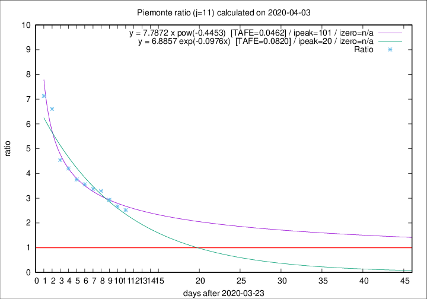

# Piemonte

Data source: https://raw.githubusercontent.com/pcm-dpc/COVID-19/master/dati-json/dpc-covid19-ita-regioni.json

Estimates in this page were made on 16/4/2020 with data available until 03/04/2020.

## Summary 

### Peak estimate 
|j|linear [TAFE]|exponential [TAFE]|power law [TAFE]|details|
|---|----|-----------|---------|-------|
|7|9/4/2020 [TAFE=0.1025]|11/4/2020 [TAFE=0.1053]|30/6/2020 [TAFE=0.1200]|[analysis](COVID-19_piemonte_j7_2020-04-03.md)|
|8|14/4/2020 [TAFE=0.0652]|19/4/2020 [TAFE=0.0637]|-|[analysis](COVID-19_piemonte_j8_2020-04-03.md)|
|9|13/4/2020 [TAFE=0.0538]|18/4/2020 [TAFE=0.0602]|-|[analysis](COVID-19_piemonte_j9_2020-04-03.md)|
|10|10/4/2020 [TAFE=0.0691]|16/4/2020 [TAFE=0.0644]|-|[analysis](COVID-19_piemonte_j10_2020-04-03.md)|
|11|7/4/2020 [TAFE=0.1275]|13/4/2020 [TAFE=0.0820]|3/7/2020 [TAFE=0.0462]|[analysis](COVID-19_piemonte_j11_2020-04-03.md)|
|12|5/4/2020 [TAFE=0.2759]|11/4/2020 [TAFE=0.1325]|22/5/2020 [TAFE=0.0799]|[analysis](COVID-19_piemonte_j12_2020-04-03.md)|
|13|4/4/2020 [TAFE=0.3064]|11/4/2020 [TAFE=0.1223]|2/6/2020 [TAFE=0.1500]|[analysis](COVID-19_piemonte_j13_2020-04-03.md)|
|14|-|-|-||

Best estimator is pow with j=11 (TAFE=0.0462)
Corresponding peak date estimate is 3/7/2020 (ipeak 101)

Peak date range estimate: 24/3/2020 - 3/7/2020

### End estimate 
|j|linear [TAFE/TFE]|exponential [TAFE/TFE]|power law [TAFE/TFE]|details|
|---|----|-----------|---------|-------|
|7|18/4/2020 [TAFE=0.1025]|-|-|[analysis](COVID-19_piemonte_j7_2020-04-03.md)|
|8|25/4/2020 [TAFE=0.0652]|-|-|[analysis](COVID-19_piemonte_j8_2020-04-03.md)|
|9|22/4/2020 [TAFE=0.0538]|-|-|[analysis](COVID-19_piemonte_j9_2020-04-03.md)|
|10|-|-|-|[analysis](COVID-19_piemonte_j10_2020-04-03.md)|
|11|-|-|-|[analysis](COVID-19_piemonte_j11_2020-04-03.md)|
|12|-|-|-|[analysis](COVID-19_piemonte_j12_2020-04-03.md)|
|13|-|-|-|[analysis](COVID-19_piemonte_j13_2020-04-03.md)|
|14|-|-|-||

Best estimator is linear with j=9 (TAFE=0.0538)
Corresponding end date estimate is 22/4/2020 (izero 27)

End date range estimate: 26/3/2020 - 24/4/2020

Generated April 16th, 2020 at 20:09:19 UTC+0200 with https://github.com/robianc/COVID-19
