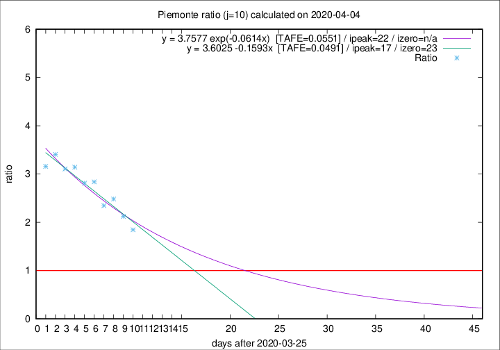

# Piemonte

Data source: https://raw.githubusercontent.com/pcm-dpc/COVID-19/master/dati-json/dpc-covid19-ita-regioni.json

Delta days analysis (j): 10

Analyses for other values of j for 2020-04-04 are avalable [here](../2020-04-04/README.md)

Analyses for Piemonte for previous dates are avalable [here](../README.md)

## Fitting 
|fit type|best fit equation|tafe|tfe|ipeak|izero|
|-------|-----|--------|------|---|---|
|linear|y = 3.6025 -0.1593x  [TAFE=0.0491]|0.0491|0.0041|17|23|
|exp|y = 3.7577 exp(-0.0614x)  [TAFE=0.0551]|0.0551|0.0023|22|n/a|

## Data
|Date|Daily deaths|Cumulated deaths|Deaths in the last 10 days|Deaths in the 10 days before|ratio|
|----|----------|-----------|-------|--------------------|-----|
|2020-04-04|85|1128|679|368|1.8451|
|2020-04-03|60|1043|669|315|2.1238|
|2020-04-02|97|983|668|269|2.4833|
|2020-04-01|32|886|603|257|2.3463|
|2020-03-31|105|854|616|217|2.8387|
|2020-03-30|65|749|540|192|2.8125|
|2020-03-29|67|684|509|162|3.1420|
|2020-03-28|48|617|463|149|3.1074|
|2020-03-27|120|569|436|128|3.4062|
|2020-03-26|0|449|338|107|3.1589|

[Download data as CSV](COVID-19_piemonte_j10_2020-04-04.csv)

Generated April 19th, 2020 at 18:42:39 UTC+0200 with https://github.com/robianc/COVID-19
