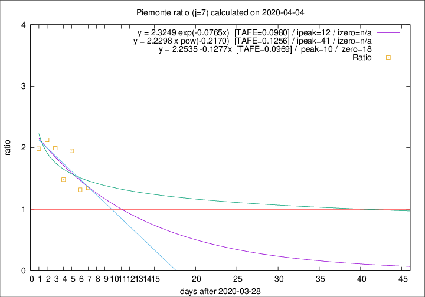

# Piemonte

Data source: https://raw.githubusercontent.com/pcm-dpc/COVID-19/master/dati-json/dpc-covid19-ita-regioni.json

Delta days analysis (j): 7

Analyses for other values of j for 2020-04-04 are avalable [here](../2020-04-04/README.md)

Analyses for Piemonte for previous dates are avalable [here](../README.md)

## Fitting 
|fit type|best fit equation|tafe|tfe|ipeak|izero|
|-------|-----|--------|------|---|---|
|linear|y = 2.2535 -0.1277x  [TAFE=0.0969]|0.0969|0.0132|10|18|
|exp|y = 2.3249 exp(-0.0765x)  [TAFE=0.0980]|0.0980|0.0065|12|n/a|
|pow|y = 2.2298 x pow(-0.2170)  [TAFE=0.1256]|0.1256|0.0086|41|n/a|

## Data
|Date|Daily deaths|Cumulated deaths|Deaths in the last 7 days|Deaths in the 7 days before|ratio|
|----|----------|-----------|-------|--------------------|-----|
|2020-04-04|85|1128|511|379|1.3483|
|2020-04-03|60|1043|474|360|1.3167|
|2020-04-02|97|983|534|274|1.9489|
|2020-04-01|32|886|437|295|1.4814|
|2020-03-31|105|854|480|241|1.9917|
|2020-03-30|65|749|434|204|2.1275|
|2020-03-29|67|684|401|202|1.9851|

[Download data as CSV](COVID-19_piemonte_j7_2020-04-04.csv)

Generated April 12th, 2020 at 17:02:01 UTC+0200 with https://github.com/robianc/COVID-19
