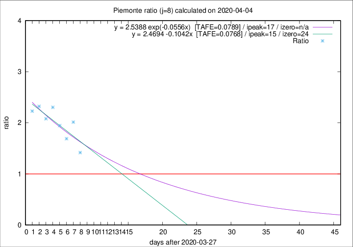

# Piemonte

Data source: https://raw.githubusercontent.com/pcm-dpc/COVID-19/master/dati-json/dpc-covid19-ita-regioni.json

Delta days analysis (j): 8

Analyses for other values of j for 2020-04-04 are avalable [here](../2020-04-04/README.md)

Analyses for Piemonte for previous dates are avalable [here](../README.md)

## Fitting 
|fit type|best fit equation|tafe|tfe|ipeak|izero|
|-------|-----|--------|------|---|---|
|linear|y = 2.4694 -0.1042x  [TAFE=0.0768]|0.0768|0.0089|15|24|
|exp|y = 2.5388 exp(-0.0556x)  [TAFE=0.0789]|0.0789|0.0044|17|n/a|

## Data
|Date|Daily deaths|Cumulated deaths|Deaths in the last 8 days|Deaths in the 8 days before|ratio|
|----|----------|-----------|-------|--------------------|-----|
|2020-04-04|85|1128|559|394|1.4188|
|2020-04-03|60|1043|594|295|2.0136|
|2020-04-02|97|983|534|316|1.6899|
|2020-04-01|32|886|512|263|1.9468|
|2020-03-31|105|854|539|234|2.3034|
|2020-03-30|65|749|466|224|2.0804|
|2020-03-29|67|684|446|192|2.3229|
|2020-03-28|48|617|408|183|2.2295|

[Download data as CSV](COVID-19_piemonte_j8_2020-04-04.csv)

Generated April 19th, 2020 at 18:42:39 UTC+0200 with https://github.com/robianc/COVID-19
