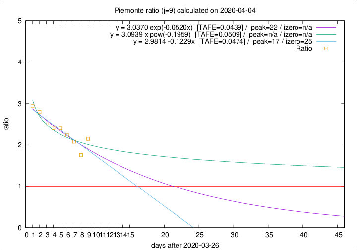

# Piemonte

Data source: https://raw.githubusercontent.com/pcm-dpc/COVID-19/master/dati-json/dpc-covid19-ita-regioni.json

Delta days analysis (j): 9

## Fitting 
|fit type|best fit equation|tafe|tfe|ipeak|izero|
|-------|-----|--------|------|---|---|
|linear|y = 2.9814 -0.1229x  [TAFE=0.0474]|0.0474|0.0039|17|25|
|exp|y = 3.0370 exp(-0.0520x)  [TAFE=0.0439]|0.0439|0.0021|22|n/a|
|pow|y = 3.0939 x pow(-0.1959)  [TAFE=0.0509]|0.0509|0.0022|n/a|n/a|

## Data
|Date|Daily deaths|Cumulated deaths|Deaths in the last 9 days|Deaths in the 9 days before|ratio|
|----|----------|-----------|-------|--------------------|-----|
|2020-04-04|85|1128|679|316|2.1487|
|2020-04-03|60|1043|594|338|1.7574|
|2020-04-02|97|983|609|293|2.0785|
|2020-04-01|32|886|571|256|2.2305|
|2020-03-31|105|854|571|237|2.4093|
|2020-03-30|65|749|511|212|2.4104|
|2020-03-29|67|684|475|188|2.5266|
|2020-03-28|48|617|442|158|2.7975|
|2020-03-27|120|569|415|141|2.9433|

[Download data as CSV](COVID-19_piemonte_j9_2020-04-04.csv)

Generated April 8th, 2020 at 23:43:36 UTC+0200 with https://github.com/robianc/COVID-19
