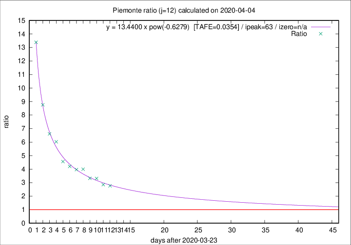

# Piemonte

Data source: https://raw.githubusercontent.com/pcm-dpc/COVID-19/master/dati-json/dpc-covid19-ita-regioni.json

Estimates in this page were made on 19/4/2020 with data available until 04/04/2020.

## Summary 

### Peak estimate 
|j|linear [TAFE]|exponential [TAFE]|power law [TAFE]|details|
|---|----|-----------|---------|-------|
|7|8/4/2020 [TAFE=0.0969]|10/4/2020 [TAFE=0.0980]|9/5/2020 [TAFE=0.1256]|[analysis](COVID-19_piemonte_j7_2020-04-04.md)|
|8|12/4/2020 [TAFE=0.0768]|14/4/2020 [TAFE=0.0789]|-|[analysis](COVID-19_piemonte_j8_2020-04-04.md)|
|9|13/4/2020 [TAFE=0.0474]|18/4/2020 [TAFE=0.0439]|-|[analysis](COVID-19_piemonte_j9_2020-04-04.md)|
|10|12/4/2020 [TAFE=0.0491]|17/4/2020 [TAFE=0.0551]|-|[analysis](COVID-19_piemonte_j10_2020-04-04.md)|
|11|8/4/2020 [TAFE=0.0870]|15/4/2020 [TAFE=0.0568]|-|[analysis](COVID-19_piemonte_j11_2020-04-04.md)|
|12|6/4/2020 [TAFE=0.2326]|12/4/2020 [TAFE=0.1193]|26/5/2020 [TAFE=0.0354]|[analysis](COVID-19_piemonte_j12_2020-04-04.md)|
|13|5/4/2020 [TAFE=0.3211]|12/4/2020 [TAFE=0.1341]|27/5/2020 [TAFE=0.1180]|[analysis](COVID-19_piemonte_j13_2020-04-04.md)|
|14|-|-|-||

Best estimator is pow with j=12 (TAFE=0.0354)
Corresponding peak date estimate is 26/5/2020 (ipeak 63)

Peak date range estimate: 24/3/2020 - 28/5/2020

### End estimate 
|j|linear [TAFE/TFE]|exponential [TAFE/TFE]|power law [TAFE/TFE]|details|
|---|----|-----------|---------|-------|
|7|16/4/2020 [TAFE=0.0969]|-|-|[analysis](COVID-19_piemonte_j7_2020-04-04.md)|
|8|21/4/2020 [TAFE=0.0768]|-|-|[analysis](COVID-19_piemonte_j8_2020-04-04.md)|
|9|21/4/2020 [TAFE=0.0474]|-|-|[analysis](COVID-19_piemonte_j9_2020-04-04.md)|
|10|-|-|-|[analysis](COVID-19_piemonte_j10_2020-04-04.md)|
|11|-|-|-|[analysis](COVID-19_piemonte_j11_2020-04-04.md)|
|12|-|-|-|[analysis](COVID-19_piemonte_j12_2020-04-04.md)|
|13|-|-|-|[analysis](COVID-19_piemonte_j13_2020-04-04.md)|
|14|-|-|-||

Best estimator is linear with j=9 (TAFE=0.0474)
Corresponding end date estimate is 21/4/2020 (izero 25)

End date range estimate: 27/3/2020 - 21/4/2020

Generated April 19th, 2020 at 18:42:39 UTC+0200 with https://github.com/robianc/COVID-19
