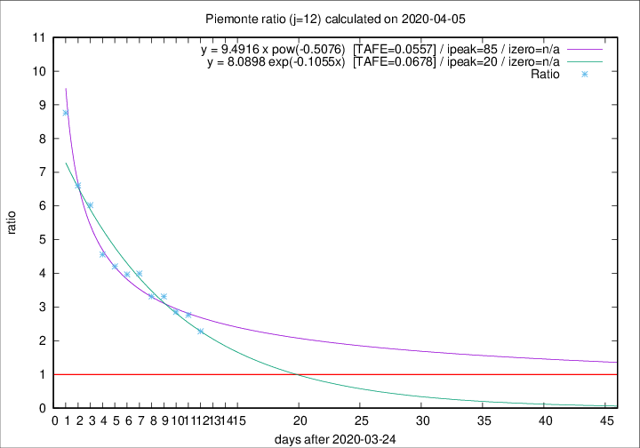

# Piemonte

Data source: https://raw.githubusercontent.com/pcm-dpc/COVID-19/master/dati-json/dpc-covid19-ita-regioni.json

Delta days analysis (j): 12

Analyses for other values of j for 2020-04-05 are avalable [here](../2020-04-05/README.md)

Analyses for Piemonte for previous dates are avalable [here](../README.md)

## Fitting 
|fit type|best fit equation|tafe|tfe|ipeak|izero|
|-------|-----|--------|------|---|---|
|exp|y = 8.0898 exp(-0.1055x)  [TAFE=0.0678]|0.0678|0.0038|20|n/a|
|pow|y = 9.4916 x pow(-0.5076)  [TAFE=0.0557]|0.0557|0.0028|85|n/a|

## Data
|Date|Daily deaths|Cumulated deaths|Deaths in the last 12 days|Deaths in the 12 days before|ratio|
|----|----------|-----------|-------|--------------------|-----|
|2020-04-05|40|1168|794|348|2.2816|
|2020-04-04|85|1128|813|294|2.7653|
|2020-04-03|60|1043|760|266|2.8571|
|2020-04-02|97|983|745|225|3.3111|
|2020-04-01|32|886|677|204|3.3186|
|2020-03-31|105|854|679|170|3.9941|
|2020-03-30|65|749|595|150|3.9667|
|2020-03-29|67|684|551|131|4.2061|
|2020-03-28|48|617|506|111|4.5586|
|2020-03-27|120|569|488|81|6.0247|
|2020-03-26|0|449|390|59|6.6102|
|2020-03-25|75|449|403|46|8.7609|

[Download data as CSV](COVID-19_piemonte_j12_2020-04-05.csv)

Generated April 16th, 2020 at 20:09:19 UTC+0200 with https://github.com/robianc/COVID-19
