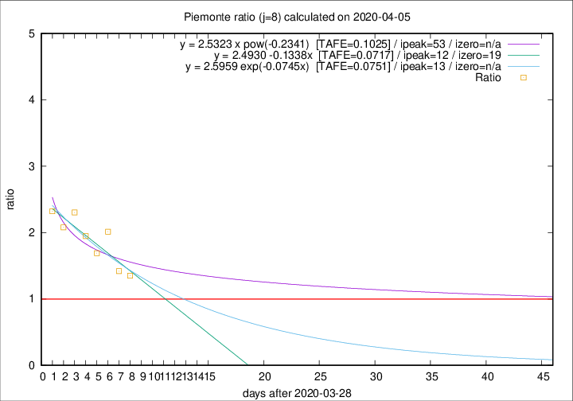

# Piemonte

Data source: https://raw.githubusercontent.com/pcm-dpc/COVID-19/master/dati-json/dpc-covid19-ita-regioni.json

Delta days analysis (j): 8

Analyses for other values of j for 2020-04-05 are avalable [here](../2020-04-05/README.md)

Analyses for Piemonte for previous dates are avalable [here](../README.md)

## Fitting 
|fit type|best fit equation|tafe|tfe|ipeak|izero|
|-------|-----|--------|------|---|---|
|linear|y = 2.4930 -0.1338x  [TAFE=0.0717]|0.0717|0.0085|12|19|
|exp|y = 2.5959 exp(-0.0745x)  [TAFE=0.0751]|0.0751|0.0040|13|n/a|
|pow|y = 2.5323 x pow(-0.2341)  [TAFE=0.1025]|0.1025|0.0068|53|n/a|

## Data
|Date|Daily deaths|Cumulated deaths|Deaths in the last 8 days|Deaths in the 8 days before|ratio|
|----|----------|-----------|-------|--------------------|-----|
|2020-04-05|40|1168|551|408|1.3505|
|2020-04-04|85|1128|559|394|1.4188|
|2020-04-03|60|1043|594|295|2.0136|
|2020-04-02|97|983|534|316|1.6899|
|2020-04-01|32|886|512|263|1.9468|
|2020-03-31|105|854|539|234|2.3034|
|2020-03-30|65|749|466|224|2.0804|
|2020-03-29|67|684|446|192|2.3229|

[Download data as CSV](COVID-19_piemonte_j8_2020-04-05.csv)

Generated April 14th, 2020 at 19:16:04 UTC+0200 with https://github.com/robianc/COVID-19
