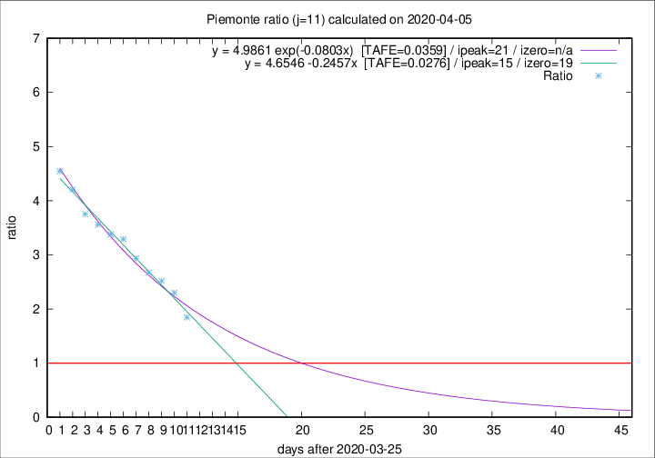

# Piemonte

Data source: https://raw.githubusercontent.com/pcm-dpc/COVID-19/master/dati-json/dpc-covid19-ita-regioni.json

Estimates in this page were made on 9/4/2020 with data available until 05/04/2020.

## Summary 

### Peak estimate 
|j|linear [TAFE]|exponential [TAFE]|power law [TAFE]|details|
|---|----|-----------|---------|-------|
|7|8/4/2020 [TAFE=0.0824]|9/4/2020 [TAFE=0.0758]|17/4/2020 [TAFE=0.0895]|[analysis](COVID-19_piemonte_j7_2020-04-05.md)|
|8|10/4/2020 [TAFE=0.0717]|11/4/2020 [TAFE=0.0751]|21/5/2020 [TAFE=0.1025]|[analysis](COVID-19_piemonte_j8_2020-04-05.md)|
|9|11/4/2020 [TAFE=0.0597]|14/4/2020 [TAFE=0.0635]|-|[analysis](COVID-19_piemonte_j9_2020-04-05.md)|
|10|12/4/2020 [TAFE=0.0537]|17/4/2020 [TAFE=0.0513]|-|[analysis](COVID-19_piemonte_j10_2020-04-05.md)|
|11|10/4/2020 [TAFE=0.0276]|16/4/2020 [TAFE=0.0359]|-|[analysis](COVID-19_piemonte_j11_2020-04-05.md)|
|12|8/4/2020 [TAFE=0.1229]|14/4/2020 [TAFE=0.0678]|18/6/2020 [TAFE=0.0557]|[analysis](COVID-19_piemonte_j12_2020-04-05.md)|
|13|6/4/2020 [TAFE=0.3228]|13/4/2020 [TAFE=0.1373]|22/5/2020 [TAFE=0.0809]|[analysis](COVID-19_piemonte_j13_2020-04-05.md)|
|14|6/4/2020 [TAFE=0.3438]|13/4/2020 [TAFE=0.1149]|1/6/2020 [TAFE=0.1617]|[analysis](COVID-19_piemonte_j14_2020-04-05.md)|

Best estimator is linear with j=11 (TAFE=0.0276)
Corresponding peak date estimate is 10/4/2020 (ipeak 15)

Peak date range estimate: 26/3/2020 - 19/6/2020

### End estimate 
|j|linear [TAFE/TFE]|exponential [TAFE/TFE]|power law [TAFE/TFE]|details|
|---|----|-----------|---------|-------|
|7|14/4/2020 [TAFE=0.0824]|-|-|[analysis](COVID-19_piemonte_j7_2020-04-05.md)|
|8|17/4/2020 [TAFE=0.0717]|-|-|[analysis](COVID-19_piemonte_j8_2020-04-05.md)|
|9|19/4/2020 [TAFE=0.0597]|-|-|[analysis](COVID-19_piemonte_j9_2020-04-05.md)|
|10|18/4/2020 [TAFE=0.0537]|-|-|[analysis](COVID-19_piemonte_j10_2020-04-05.md)|
|11|14/4/2020 [TAFE=0.0276]|-|-|[analysis](COVID-19_piemonte_j11_2020-04-05.md)|
|12|-|-|-|[analysis](COVID-19_piemonte_j12_2020-04-05.md)|
|13|-|-|-|[analysis](COVID-19_piemonte_j13_2020-04-05.md)|
|14|-|-|-|[analysis](COVID-19_piemonte_j14_2020-04-05.md)|

Best estimator is linear with j=11 (TAFE=0.0276)
Corresponding end date estimate is 14/4/2020 (izero 19)

End date range estimate: 26/3/2020 - 17/4/2020

Generated April 9th, 2020 at 16:40:48 UTC+0200 with https://github.com/robianc/COVID-19
