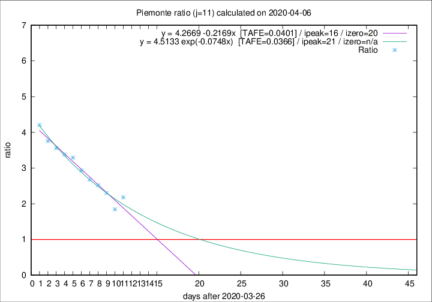

# Piemonte

Data source: https://raw.githubusercontent.com/pcm-dpc/COVID-19/master/dati-json/dpc-covid19-ita-regioni.json

Estimates in this page were made on 9/4/2020 with data available until 06/04/2020.

## Summary 

### Peak estimate 
|j|linear [TAFE]|exponential [TAFE]|power law [TAFE]|details|
|---|----|-----------|---------|-------|
|7|8/4/2020 [TAFE=0.0882]|9/4/2020 [TAFE=0.0805]|15/4/2020 [TAFE=0.0772]|[analysis](COVID-19_piemonte_j7_2020-04-06.md)|
|8|9/4/2020 [TAFE=0.0698]|11/4/2020 [TAFE=0.0695]|1/5/2020 [TAFE=0.1043]|[analysis](COVID-19_piemonte_j8_2020-04-06.md)|
|9|11/4/2020 [TAFE=0.0622]|13/4/2020 [TAFE=0.0694]|10/6/2020 [TAFE=0.1069]|[analysis](COVID-19_piemonte_j9_2020-04-06.md)|
|10|12/4/2020 [TAFE=0.0589]|15/4/2020 [TAFE=0.0609]|-|[analysis](COVID-19_piemonte_j10_2020-04-06.md)|
|11|12/4/2020 [TAFE=0.0401]|17/4/2020 [TAFE=0.0366]|-|[analysis](COVID-19_piemonte_j11_2020-04-06.md)|
|12|10/4/2020 [TAFE=0.0783]|15/4/2020 [TAFE=0.0585]|24/6/2020 [TAFE=0.0879]|[analysis](COVID-19_piemonte_j12_2020-04-06.md)|
|13|7/4/2020 [TAFE=0.2597]|14/4/2020 [TAFE=0.1091]|23/5/2020 [TAFE=0.0591]|[analysis](COVID-19_piemonte_j13_2020-04-06.md)|
|14|7/4/2020 [TAFE=0.3594]|13/4/2020 [TAFE=0.1254]|25/5/2020 [TAFE=0.1196]|[analysis](COVID-19_piemonte_j14_2020-04-06.md)|

Best estimator is exp with j=11 (TAFE=0.0366)
Corresponding peak date estimate is 17/4/2020 (ipeak 21)

Peak date range estimate: 27/3/2020 - 25/6/2020

### End estimate 
|j|linear [TAFE/TFE]|exponential [TAFE/TFE]|power law [TAFE/TFE]|details|
|---|----|-----------|---------|-------|
|7|16/4/2020 [TAFE=0.0882]|-|-|[analysis](COVID-19_piemonte_j7_2020-04-06.md)|
|8|17/4/2020 [TAFE=0.0698]|-|-|[analysis](COVID-19_piemonte_j8_2020-04-06.md)|
|9|18/4/2020 [TAFE=0.0622]|-|-|[analysis](COVID-19_piemonte_j9_2020-04-06.md)|
|10|17/4/2020 [TAFE=0.0589]|-|-|[analysis](COVID-19_piemonte_j10_2020-04-06.md)|
|11|16/4/2020 [TAFE=0.0401]|-|-|[analysis](COVID-19_piemonte_j11_2020-04-06.md)|
|12|-|-|-|[analysis](COVID-19_piemonte_j12_2020-04-06.md)|
|13|-|-|-|[analysis](COVID-19_piemonte_j13_2020-04-06.md)|
|14|-|-|-|[analysis](COVID-19_piemonte_j14_2020-04-06.md)|

Best estimator is linear with j=11 (TAFE=0.0401)
Corresponding end date estimate is 16/4/2020 (izero 20)

End date range estimate: 27/3/2020 - 16/4/2020

Generated April 9th, 2020 at 16:40:48 UTC+0200 with https://github.com/robianc/COVID-19
