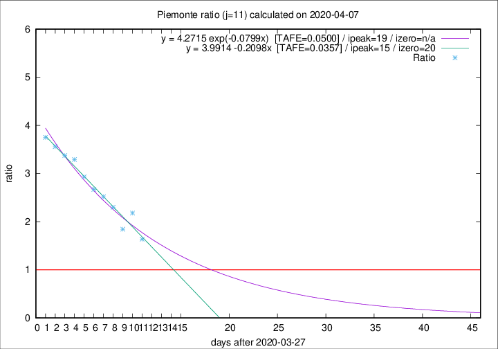

# Piemonte

Data source: https://raw.githubusercontent.com/pcm-dpc/COVID-19/master/dati-json/dpc-covid19-ita-regioni.json

Delta days analysis (j): 11

## Fitting 
|fit type|best fit equation|tafe|tfe|ipeak|izero|
|-------|-----|--------|------|---|---|
|linear|y = 3.9914 -0.2098x  [TAFE=0.0357]|0.0357|0.0034|15|20|
|exp|y = 4.2715 exp(-0.0799x)  [TAFE=0.0500]|0.0500|0.0021|19|n/a|

## Data
|Date|Daily deaths|Cumulated deaths|Deaths in the last 11 days|Deaths in the 11 days before|ratio|
|----|----------|-----------|-------|--------------------|-----|
|2020-04-07|68|1319|750|458|1.6376|
|2020-04-06|83|1251|802|368|2.1793|
|2020-04-05|40|1168|719|390|1.8436|
|2020-04-04|85|1128|754|328|2.2988|
|2020-04-03|60|1043|728|289|2.5190|
|2020-04-02|97|983|700|262|2.6718|
|2020-04-01|32|886|648|221|2.9321|
|2020-03-31|105|854|645|196|3.2908|
|2020-03-30|65|749|574|170|3.3765|
|2020-03-29|67|684|530|149|3.5570|
|2020-03-28|48|617|484|129|3.7519|

[Download data as CSV](COVID-19_piemonte_j11_2020-04-07.csv)

Generated April 9th, 2020 at 16:40:48 UTC+0200 with https://github.com/robianc/COVID-19
