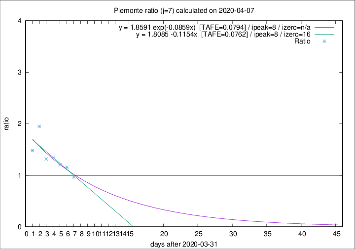

# Piemonte

Data source: https://raw.githubusercontent.com/pcm-dpc/COVID-19/master/dati-json/dpc-covid19-ita-regioni.json

Delta days analysis (j): 7

## Fitting 
|fit type|best fit equation|tafe|tfe|ipeak|izero|
|-------|-----|--------|------|---|---|
|linear|y = 1.8085 -0.1154x  [TAFE=0.0762]|0.0762|0.0115|8|16|
|exp|y = 1.8591 exp(-0.0859x)  [TAFE=0.0794]|0.0794|0.0055|8|n/a|

## Data
|Date|Daily deaths|Cumulated deaths|Deaths in the last 7 days|Deaths in the 7 days before|ratio|
|----|----------|-----------|-------|--------------------|-----|
|2020-04-07|68|1319|465|480|0.9688|
|2020-04-06|83|1251|502|434|1.1567|
|2020-04-05|40|1168|484|401|1.2070|
|2020-04-04|85|1128|511|379|1.3483|
|2020-04-03|60|1043|474|360|1.3167|
|2020-04-02|97|983|534|274|1.9489|
|2020-04-01|32|886|437|295|1.4814|

[Download data as CSV](COVID-19_piemonte_j7_2020-04-07.csv)

Generated April 8th, 2020 at 23:43:36 UTC+0200 with https://github.com/robianc/COVID-19
