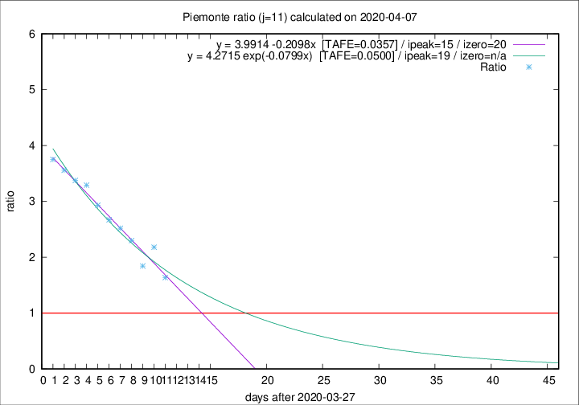

# Piemonte

Data source: https://raw.githubusercontent.com/pcm-dpc/COVID-19/master/dati-json/dpc-covid19-ita-regioni.json

Estimates in this page were made on 16/4/2020 with data available until 07/04/2020.

## Summary 

### Peak estimate 
|j|linear [TAFE]|exponential [TAFE]|power law [TAFE]|details|
|---|----|-----------|---------|-------|
|7|9/4/2020 [TAFE=0.0762]|9/4/2020 [TAFE=0.0794]|12/4/2020 [TAFE=0.0960]|[analysis](COVID-19_piemonte_j7_2020-04-07.md)|
|8|9/4/2020 [TAFE=0.0751]|10/4/2020 [TAFE=0.0639]|18/4/2020 [TAFE=0.0576]|[analysis](COVID-19_piemonte_j8_2020-04-07.md)|
|9|11/4/2020 [TAFE=0.0560]|12/4/2020 [TAFE=0.0598]|10/5/2020 [TAFE=0.1045]|[analysis](COVID-19_piemonte_j9_2020-04-07.md)|
|10|11/4/2020 [TAFE=0.0566]|14/4/2020 [TAFE=0.0548]|30/5/2020 [TAFE=0.0913]|[analysis](COVID-19_piemonte_j10_2020-04-07.md)|
|11|12/4/2020 [TAFE=0.0357]|16/4/2020 [TAFE=0.0500]|3/7/2020 [TAFE=0.1023]|[analysis](COVID-19_piemonte_j11_2020-04-07.md)|
|12|11/4/2020 [TAFE=0.0692]|16/4/2020 [TAFE=0.0625]|30/6/2020 [TAFE=0.0860]|[analysis](COVID-19_piemonte_j12_2020-04-07.md)|
|13|9/4/2020 [TAFE=0.1285]|15/4/2020 [TAFE=0.0564]|9/6/2020 [TAFE=0.1002]|[analysis](COVID-19_piemonte_j13_2020-04-07.md)|
|14|8/4/2020 [TAFE=0.3465]|14/4/2020 [TAFE=0.1209]|21/5/2020 [TAFE=0.0772]|[analysis](COVID-19_piemonte_j14_2020-04-07.md)|

Best estimator is linear with j=11 (TAFE=0.0357)
Corresponding peak date estimate is 12/4/2020 (ipeak 15)

Peak date range estimate: 5/4/2020 - 3/7/2020

### End estimate 
|j|linear [TAFE/TFE]|exponential [TAFE/TFE]|power law [TAFE/TFE]|details|
|---|----|-----------|---------|-------|
|7|17/4/2020 [TAFE=0.0762]|-|-|[analysis](COVID-19_piemonte_j7_2020-04-07.md)|
|8|16/4/2020 [TAFE=0.0751]|-|-|[analysis](COVID-19_piemonte_j8_2020-04-07.md)|
|9|18/4/2020 [TAFE=0.0560]|-|-|[analysis](COVID-19_piemonte_j9_2020-04-07.md)|
|10|-|-|-|[analysis](COVID-19_piemonte_j10_2020-04-07.md)|
|11|17/4/2020 [TAFE=0.0357]|-|-|[analysis](COVID-19_piemonte_j11_2020-04-07.md)|
|12|-|-|-|[analysis](COVID-19_piemonte_j12_2020-04-07.md)|
|13|-|-|-|[analysis](COVID-19_piemonte_j13_2020-04-07.md)|
|14|-|-|-|[analysis](COVID-19_piemonte_j14_2020-04-07.md)|

Best estimator is linear with j=11 (TAFE=0.0357)
Corresponding end date estimate is 17/4/2020 (izero 20)

End date range estimate: 28/3/2020 - 17/4/2020

Generated April 16th, 2020 at 20:09:19 UTC+0200 with https://github.com/robianc/COVID-19
