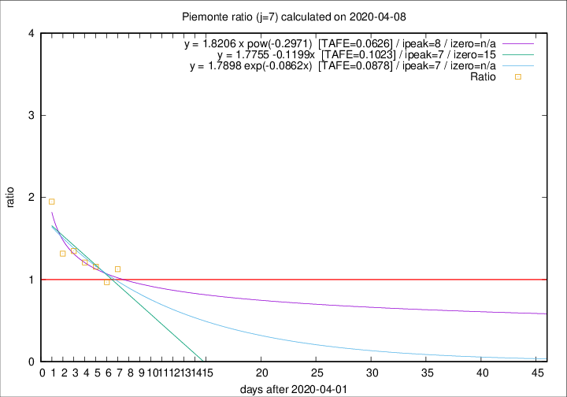

# Piemonte

Data source: https://raw.githubusercontent.com/pcm-dpc/COVID-19/master/dati-json/dpc-covid19-ita-regioni.json

Delta days analysis (j): 7

Analyses for other values of j for 2020-04-08 are avalable [here](../2020-04-08/README.md)

Analyses for Piemonte for previous dates are avalable [here](../README.md)

## Fitting 
|fit type|best fit equation|tafe|tfe|ipeak|izero|
|-------|-----|--------|------|---|---|
|linear|y = 1.7755 -0.1199x  [TAFE=0.1023]|0.1023|0.0111|7|15|
|exp|y = 1.7898 exp(-0.0862x)  [TAFE=0.0878]|0.0878|0.0055|7|n/a|
|pow|y = 1.8206 x pow(-0.2971)  [TAFE=0.0626]|0.0626|0.0028|8|n/a|

## Data
|Date|Daily deaths|Cumulated deaths|Deaths in the last 7 days|Deaths in the 7 days before|ratio|
|----|----------|-----------|-------|--------------------|-----|
|2020-04-08|59|1378|492|437|1.1259|
|2020-04-07|68|1319|465|480|0.9688|
|2020-04-06|83|1251|502|434|1.1567|
|2020-04-05|40|1168|484|401|1.2070|
|2020-04-04|85|1128|511|379|1.3483|
|2020-04-03|60|1043|474|360|1.3167|
|2020-04-02|97|983|534|274|1.9489|

[Download data as CSV](COVID-19_piemonte_j7_2020-04-08.csv)

Generated April 19th, 2020 at 18:42:39 UTC+0200 with https://github.com/robianc/COVID-19
