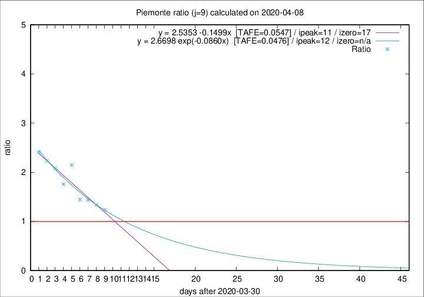

# Piemonte

Data source: https://raw.githubusercontent.com/pcm-dpc/COVID-19/master/dati-json/dpc-covid19-ita-regioni.json

Delta days analysis (j): 9

## Fitting 
|fit type|best fit equation|tafe|tfe|ipeak|izero|
|-------|-----|--------|------|---|---|
|linear|y = 2.5353 -0.1499x  [TAFE=0.0547]|0.0547|0.0068|11|17|
|exp|y = 2.6698 exp(-0.0860x)  [TAFE=0.0476]|0.0476|0.0033|12|n/a|

## Data
|Date|Daily deaths|Cumulated deaths|Deaths in the last 9 days|Deaths in the 9 days before|ratio|
|----|----------|-----------|-------|--------------------|-----|
|2020-04-08|59|1378|629|511|1.2309|
|2020-04-07|68|1319|635|475|1.3368|
|2020-04-06|83|1251|634|442|1.4344|
|2020-04-05|40|1168|599|415|1.4434|
|2020-04-04|85|1128|679|316|2.1487|
|2020-04-03|60|1043|594|338|1.7574|
|2020-04-02|97|983|609|293|2.0785|
|2020-04-01|32|886|571|256|2.2305|
|2020-03-31|105|854|571|237|2.4093|

[Download data as CSV](COVID-19_piemonte_j9_2020-04-08.csv)

Generated April 9th, 2020 at 16:40:48 UTC+0200 with https://github.com/robianc/COVID-19
