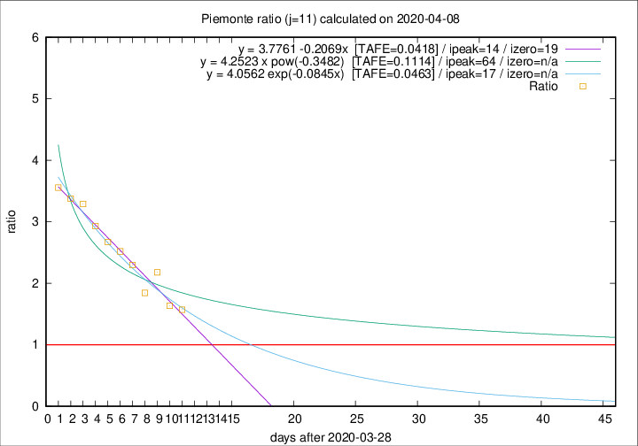

# Piemonte

Data source: https://raw.githubusercontent.com/pcm-dpc/COVID-19/master/dati-json/dpc-covid19-ita-regioni.json

Estimates in this page were made on 14/4/2020 with data available until 08/04/2020.

## Summary 

### Peak estimate 
|j|linear [TAFE]|exponential [TAFE]|power law [TAFE]|details|
|---|----|-----------|---------|-------|
|7|9/4/2020 [TAFE=0.1023]|9/4/2020 [TAFE=0.0878]|10/4/2020 [TAFE=0.0626]|[analysis](COVID-19_piemonte_j7_2020-04-08.md)|
|8|10/4/2020 [TAFE=0.0630]|10/4/2020 [TAFE=0.0659]|14/4/2020 [TAFE=0.0767]|[analysis](COVID-19_piemonte_j8_2020-04-08.md)|
|9|11/4/2020 [TAFE=0.0547]|12/4/2020 [TAFE=0.0476]|25/4/2020 [TAFE=0.0816]|[analysis](COVID-19_piemonte_j9_2020-04-08.md)|
|10|12/4/2020 [TAFE=0.0535]|14/4/2020 [TAFE=0.0551]|14/5/2020 [TAFE=0.0981]|[analysis](COVID-19_piemonte_j10_2020-04-08.md)|
|11|12/4/2020 [TAFE=0.0418]|15/4/2020 [TAFE=0.0463]|1/6/2020 [TAFE=0.1114]|[analysis](COVID-19_piemonte_j11_2020-04-08.md)|
|12|12/4/2020 [TAFE=0.0452]|16/4/2020 [TAFE=0.0568]|25/6/2020 [TAFE=0.1183]|[analysis](COVID-19_piemonte_j12_2020-04-08.md)|
|13|11/4/2020 [TAFE=0.1119]|16/4/2020 [TAFE=0.0590]|6/6/2020 [TAFE=0.0778]|[analysis](COVID-19_piemonte_j13_2020-04-08.md)|
|14|9/4/2020 [TAFE=0.2567]|15/4/2020 [TAFE=0.0893]|21/5/2020 [TAFE=0.0799]|[analysis](COVID-19_piemonte_j14_2020-04-08.md)|

Best estimator is linear with j=11 (TAFE=0.0418)
Corresponding peak date estimate is 12/4/2020 (ipeak 14)

Peak date range estimate: 5/4/2020 - 26/6/2020

### End estimate 
|j|linear [TAFE/TFE]|exponential [TAFE/TFE]|power law [TAFE/TFE]|details|
|---|----|-----------|---------|-------|
|7|17/4/2020 [TAFE=0.1023]|-|-|[analysis](COVID-19_piemonte_j7_2020-04-08.md)|
|8|17/4/2020 [TAFE=0.0630]|-|-|[analysis](COVID-19_piemonte_j8_2020-04-08.md)|
|9|17/4/2020 [TAFE=0.0547]|-|-|[analysis](COVID-19_piemonte_j9_2020-04-08.md)|
|10|18/4/2020 [TAFE=0.0535]|-|-|[analysis](COVID-19_piemonte_j10_2020-04-08.md)|
|11|17/4/2020 [TAFE=0.0418]|-|-|[analysis](COVID-19_piemonte_j11_2020-04-08.md)|
|12|-|-|-|[analysis](COVID-19_piemonte_j12_2020-04-08.md)|
|13|-|-|-|[analysis](COVID-19_piemonte_j13_2020-04-08.md)|
|14|-|-|-|[analysis](COVID-19_piemonte_j14_2020-04-08.md)|

Best estimator is linear with j=11 (TAFE=0.0418)
Corresponding end date estimate is 17/4/2020 (izero 19)

End date range estimate: 29/3/2020 - 17/4/2020

Generated April 14th, 2020 at 19:16:04 UTC+0200 with https://github.com/robianc/COVID-19
