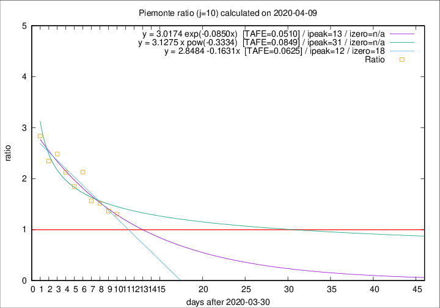

# Piemonte

Data source: https://raw.githubusercontent.com/pcm-dpc/COVID-19/master/dati-json/dpc-covid19-ita-regioni.json

Delta days analysis (j): 10

Analyses for other values of j for 2020-04-09 are avalable [here](../2020-04-09/README.md)

Analyses for Piemonte for previous dates are avalable [here](../README.md)

## Fitting 
|fit type|best fit equation|tafe|tfe|ipeak|izero|
|-------|-----|--------|------|---|---|
|linear|y = 2.8484 -0.1631x  [TAFE=0.0625]|0.0625|0.0040|12|18|
|exp|y = 3.0174 exp(-0.0850x)  [TAFE=0.0510]|0.0510|0.0025|13|n/a|
|pow|y = 3.1275 x pow(-0.3334)  [TAFE=0.0849]|0.0849|0.0051|31|n/a|

## Data
|Date|Daily deaths|Cumulated deaths|Deaths in the last 10 days|Deaths in the 10 days before|ratio|
|----|----------|-----------|-------|--------------------|-----|
|2020-04-09|76|1454|705|540|1.3056|
|2020-04-08|59|1378|694|509|1.3635|
|2020-04-07|68|1319|702|463|1.5162|
|2020-04-06|83|1251|682|436|1.5642|
|2020-04-05|40|1168|719|338|2.1272|
|2020-04-04|85|1128|679|368|1.8451|
|2020-04-03|60|1043|669|315|2.1238|
|2020-04-02|97|983|668|269|2.4833|
|2020-04-01|32|886|603|257|2.3463|
|2020-03-31|105|854|616|217|2.8387|

[Download data as CSV](COVID-19_piemonte_j10_2020-04-09.csv)

Generated April 12th, 2020 at 17:02:01 UTC+0200 with https://github.com/robianc/COVID-19
