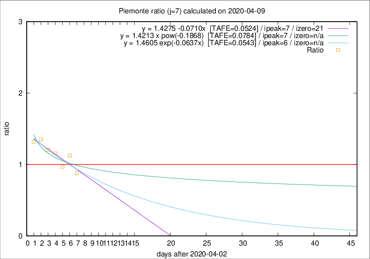

# Piemonte

Data source: https://raw.githubusercontent.com/pcm-dpc/COVID-19/master/dati-json/dpc-covid19-ita-regioni.json

Delta days analysis (j): 7

## Fitting 
|fit type|best fit equation|tafe|tfe|ipeak|izero|
|-------|-----|--------|------|---|---|
|linear|y = 1.4275 -0.0710x  [TAFE=0.0524]|0.0524|0.0043|7|21|
|exp|y = 1.4605 exp(-0.0637x)  [TAFE=0.0543]|0.0543|0.0021|6|n/a|
|pow|y = 1.4213 x pow(-0.1868)  [TAFE=0.0784]|0.0784|0.0033|7|n/a|

## Data
|Date|Daily deaths|Cumulated deaths|Deaths in the last 7 days|Deaths in the 7 days before|ratio|
|----|----------|-----------|-------|--------------------|-----|
|2020-04-09|76|1454|471|534|0.8820|
|2020-04-08|59|1378|492|437|1.1259|
|2020-04-07|68|1319|465|480|0.9688|
|2020-04-06|83|1251|502|434|1.1567|
|2020-04-05|40|1168|484|401|1.2070|
|2020-04-04|85|1128|511|379|1.3483|
|2020-04-03|60|1043|474|360|1.3167|

[Download data as CSV](COVID-19_piemonte_j7_2020-04-09.csv)

Generated April 9th, 2020 at 16:40:48 UTC+0200 with https://github.com/robianc/COVID-19
