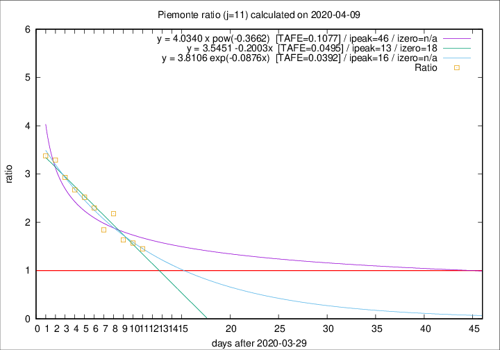

# Piemonte

Data source: https://raw.githubusercontent.com/pcm-dpc/COVID-19/master/dati-json/dpc-covid19-ita-regioni.json

Estimates in this page were made on 14/4/2020 with data available until 09/04/2020.

## Summary 

### Peak estimate 
|j|linear [TAFE]|exponential [TAFE]|power law [TAFE]|details|
|---|----|-----------|---------|-------|
|7|10/4/2020 [TAFE=0.0524]|9/4/2020 [TAFE=0.0543]|10/4/2020 [TAFE=0.0784]|[analysis](COVID-19_piemonte_j7_2020-04-09.md)|
|8|10/4/2020 [TAFE=0.0869]|11/4/2020 [TAFE=0.0787]|13/4/2020 [TAFE=0.0783]|[analysis](COVID-19_piemonte_j8_2020-04-09.md)|
|9|11/4/2020 [TAFE=0.0533]|11/4/2020 [TAFE=0.0548]|18/4/2020 [TAFE=0.0758]|[analysis](COVID-19_piemonte_j9_2020-04-09.md)|
|10|12/4/2020 [TAFE=0.0625]|13/4/2020 [TAFE=0.0510]|1/5/2020 [TAFE=0.0849]|[analysis](COVID-19_piemonte_j10_2020-04-09.md)|
|11|12/4/2020 [TAFE=0.0495]|15/4/2020 [TAFE=0.0392]|15/5/2020 [TAFE=0.1077]|[analysis](COVID-19_piemonte_j11_2020-04-09.md)|
|12|12/4/2020 [TAFE=0.0556]|16/4/2020 [TAFE=0.0537]|3/6/2020 [TAFE=0.1209]|[analysis](COVID-19_piemonte_j12_2020-04-09.md)|
|13|12/4/2020 [TAFE=0.0681]|17/4/2020 [TAFE=0.0497]|8/6/2020 [TAFE=0.1140]|[analysis](COVID-19_piemonte_j13_2020-04-09.md)|
|14|11/4/2020 [TAFE=0.1762]|17/4/2020 [TAFE=0.0732]|30/5/2020 [TAFE=0.0915]|[analysis](COVID-19_piemonte_j14_2020-04-09.md)|

Best estimator is exp with j=11 (TAFE=0.0392)
Corresponding peak date estimate is 15/4/2020 (ipeak 16)

Peak date range estimate: 5/4/2020 - 10/6/2020

### End estimate 
|j|linear [TAFE/TFE]|exponential [TAFE/TFE]|power law [TAFE/TFE]|details|
|---|----|-----------|---------|-------|
|7|24/4/2020 [TAFE=0.0524]|-|-|[analysis](COVID-19_piemonte_j7_2020-04-09.md)|
|8|-|-|-|[analysis](COVID-19_piemonte_j8_2020-04-09.md)|
|9|-|-|-|[analysis](COVID-19_piemonte_j9_2020-04-09.md)|
|10|-|-|-|[analysis](COVID-19_piemonte_j10_2020-04-09.md)|
|11|17/4/2020 [TAFE=0.0495]|-|-|[analysis](COVID-19_piemonte_j11_2020-04-09.md)|
|12|-|-|-|[analysis](COVID-19_piemonte_j12_2020-04-09.md)|
|13|-|-|-|[analysis](COVID-19_piemonte_j13_2020-04-09.md)|
|14|-|-|-|[analysis](COVID-19_piemonte_j14_2020-04-09.md)|

Best estimator is linear with j=11 (TAFE=0.0495)
Corresponding end date estimate is 17/4/2020 (izero 18)

End date range estimate: 30/3/2020 - 20/4/2020

Generated April 14th, 2020 at 19:16:04 UTC+0200 with https://github.com/robianc/COVID-19
