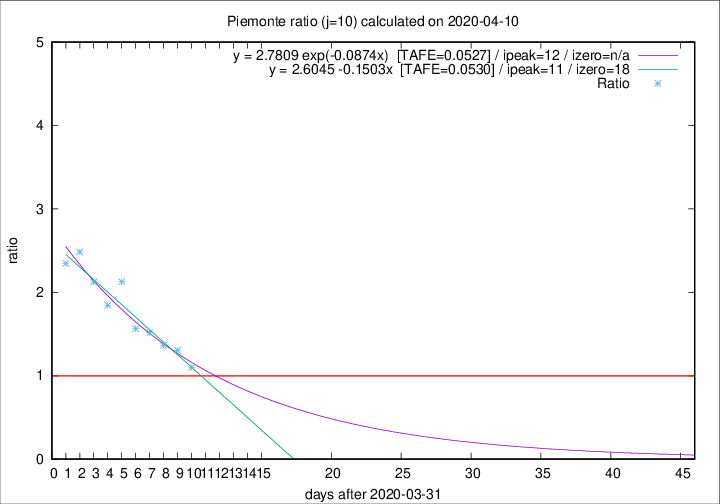

# Piemonte

Data source: https://raw.githubusercontent.com/pcm-dpc/COVID-19/master/dati-json/dpc-covid19-ita-regioni.json

Delta days analysis (j): 10

Analyses for other values of j for 2020-04-10 are avalable [here](../README.md)

Analyses for Piemonte for previous dates are avalable [here](../../README.md)

## Fitting 
|fit type|best fit equation|tafe|tfe|ipeak|izero|
|-------|-----|--------|------|---|---|
|linear|y = 2.6045 -0.1503x  [TAFE=0.0530]|0.0530|0.0045|11|18|
|exp|y = 2.7809 exp(-0.0874x)  [TAFE=0.0527]|0.0527|0.0026|12|n/a|

## Data
|Date|Daily deaths|Cumulated deaths|Deaths in the last 10 days|Deaths in the 10 days before|ratio|
|----|----------|-----------|-------|--------------------|-----|
|2020-04-10|78|1532|678|616|1.1006|
|2020-04-09|76|1454|705|540|1.3056|
|2020-04-08|59|1378|694|509|1.3635|
|2020-04-07|68|1319|702|463|1.5162|
|2020-04-06|83|1251|682|436|1.5642|
|2020-04-05|40|1168|719|338|2.1272|
|2020-04-04|85|1128|679|368|1.8451|
|2020-04-03|60|1043|669|315|2.1238|
|2020-04-02|97|983|668|269|2.4833|
|2020-04-01|32|886|603|257|2.3463|

[Download data as CSV](COVID-19_piemonte_j10_2020-04-10.csv)

Generated April 12th, 2020 at 16:28:18 UTC+0200 with https://github.com/robianc/COVID-19
