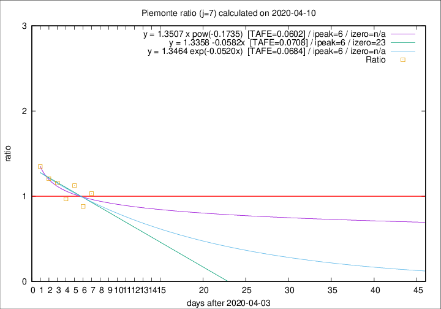

# Piemonte

Data source: https://raw.githubusercontent.com/pcm-dpc/COVID-19/master/dati-json/dpc-covid19-ita-regioni.json

Delta days analysis (j): 7

Analyses for other values of j for 2020-04-10 are avalable [here](../README.md)

Analyses for Piemonte for previous dates are avalable [here](../../README.md)

## Fitting 
|fit type|best fit equation|tafe|tfe|ipeak|izero|
|-------|-----|--------|------|---|---|
|linear|y = 1.3358 -0.0582x  [TAFE=0.0708]|0.0708|0.0067|6|23|
|exp|y = 1.3464 exp(-0.0520x)  [TAFE=0.0684]|0.0684|0.0035|6|n/a|
|pow|y = 1.3507 x pow(-0.1735)  [TAFE=0.0602]|0.0602|0.0027|6|n/a|

## Data
|Date|Daily deaths|Cumulated deaths|Deaths in the last 7 days|Deaths in the 7 days before|ratio|
|----|----------|-----------|-------|--------------------|-----|
|2020-04-10|78|1532|489|474|1.0316|
|2020-04-09|76|1454|471|534|0.8820|
|2020-04-08|59|1378|492|437|1.1259|
|2020-04-07|68|1319|465|480|0.9688|
|2020-04-06|83|1251|502|434|1.1567|
|2020-04-05|40|1168|484|401|1.2070|
|2020-04-04|85|1128|511|379|1.3483|

[Download data as CSV](COVID-19_piemonte_j7_2020-04-10.csv)

Generated April 10th, 2020 at 17:26:10 UTC+0200 with https://github.com/robianc/COVID-19
