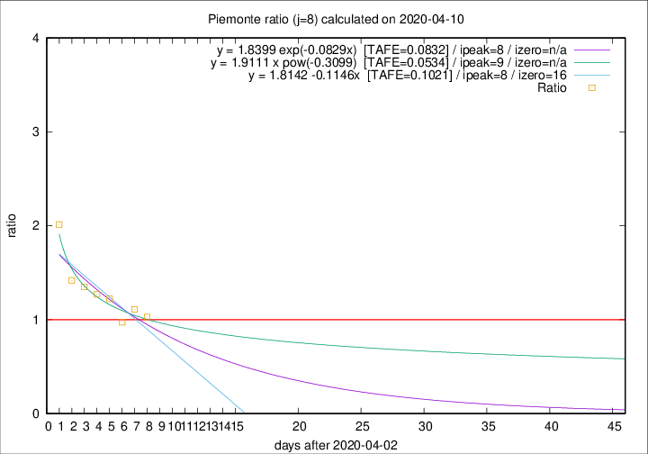

# Piemonte

Data source: https://raw.githubusercontent.com/pcm-dpc/COVID-19/master/dati-json/dpc-covid19-ita-regioni.json

Delta days analysis (j): 8

Analyses for other values of j for 2020-04-10 are avalable [here](../README.md)

Analyses for Piemonte for previous dates are avalable [here](../../README.md)

## Fitting 
|fit type|best fit equation|tafe|tfe|ipeak|izero|
|-------|-----|--------|------|---|---|
|linear|y = 1.8142 -0.1146x  [TAFE=0.1021]|0.1021|0.0094|8|16|
|exp|y = 1.8399 exp(-0.0829x)  [TAFE=0.0832]|0.0832|0.0045|8|n/a|
|pow|y = 1.9111 x pow(-0.3099)  [TAFE=0.0534]|0.0534|0.0020|9|n/a|

## Data
|Date|Daily deaths|Cumulated deaths|Deaths in the last 8 days|Deaths in the 8 days before|ratio|
|----|----------|-----------|-------|--------------------|-----|
|2020-04-10|78|1532|549|534|1.0281|
|2020-04-09|76|1454|568|512|1.1094|
|2020-04-08|59|1378|524|539|0.9722|
|2020-04-07|68|1319|570|466|1.2232|
|2020-04-06|83|1251|567|446|1.2713|
|2020-04-05|40|1168|551|408|1.3505|
|2020-04-04|85|1128|559|394|1.4188|
|2020-04-03|60|1043|594|295|2.0136|

[Download data as CSV](COVID-19_piemonte_j8_2020-04-10.csv)

Generated April 12th, 2020 at 16:28:18 UTC+0200 with https://github.com/robianc/COVID-19
