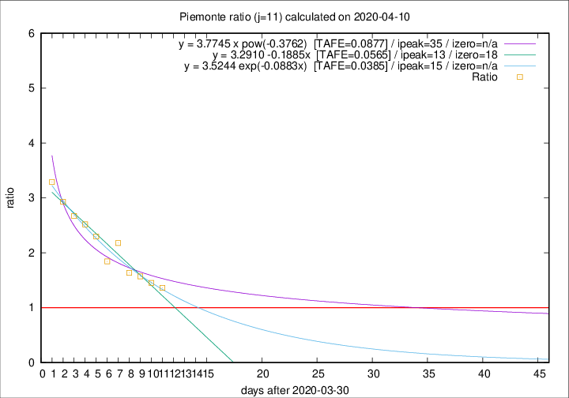
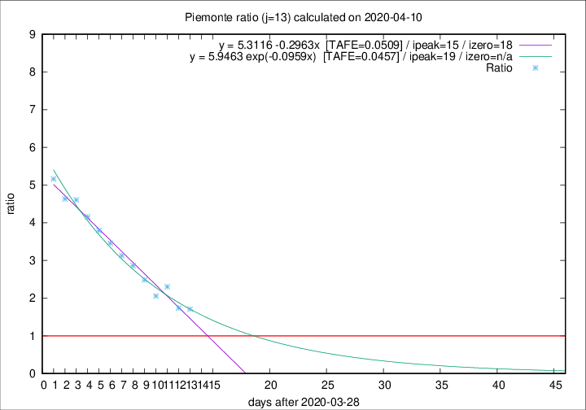

# Piemonte

Data source: https://raw.githubusercontent.com/pcm-dpc/COVID-19/master/dati-json/dpc-covid19-ita-regioni.json

Estimates in this page were made on 12/4/2020 with data available until 10/04/2020.

## Summary 

### Peak estimate 
|j|linear [TAFE]|exponential [TAFE]|power law [TAFE]|details|
|---|----|-----------|---------|-------|
|7|10/4/2020 [TAFE=0.0708]|10/4/2020 [TAFE=0.0684]|10/4/2020 [TAFE=0.0602]|[analysis](COVID-19_piemonte_j7_2020-04-10.md)|
|8|11/4/2020 [TAFE=0.1021]|11/4/2020 [TAFE=0.0832]|12/4/2020 [TAFE=0.0534]|[analysis](COVID-19_piemonte_j8_2020-04-10.md)|
|9|11/4/2020 [TAFE=0.0793]|12/4/2020 [TAFE=0.0642]|17/4/2020 [TAFE=0.0724]|[analysis](COVID-19_piemonte_j9_2020-04-10.md)|
|10|12/4/2020 [TAFE=0.0530]|13/4/2020 [TAFE=0.0527]|25/4/2020 [TAFE=0.0935]|[analysis](COVID-19_piemonte_j10_2020-04-10.md)|
|11|13/4/2020 [TAFE=0.0565]|15/4/2020 [TAFE=0.0385]|5/5/2020 [TAFE=0.0877]|[analysis](COVID-19_piemonte_j11_2020-04-10.md)|
|12|13/4/2020 [TAFE=0.0677]|16/4/2020 [TAFE=0.0512]|18/5/2020 [TAFE=0.1152]|[analysis](COVID-19_piemonte_j12_2020-04-10.md)|
|13|13/4/2020 [TAFE=0.0509]|17/4/2020 [TAFE=0.0457]|4/6/2020 [TAFE=0.1347]|[analysis](COVID-19_piemonte_j13_2020-04-10.md)|
|14|12/4/2020 [TAFE=0.1247]|17/4/2020 [TAFE=0.0586]|28/5/2020 [TAFE=0.1050]|[analysis](COVID-19_piemonte_j14_2020-04-10.md)|

Best estimator is exp with j=11 (TAFE=0.0385)
Corresponding peak date estimate is 15/4/2020 (ipeak 15)

Peak date range estimate: 6/4/2020 - 6/6/2020

### End estimate 
|j|linear [TAFE/TFE]|exponential [TAFE/TFE]|power law [TAFE/TFE]|details|
|---|----|-----------|---------|-------|
|7|27/4/2020 [TAFE=0.0708]|-|-|[analysis](COVID-19_piemonte_j7_2020-04-10.md)|
|8|-|-|-|[analysis](COVID-19_piemonte_j8_2020-04-10.md)|
|9|-|-|-|[analysis](COVID-19_piemonte_j9_2020-04-10.md)|
|10|19/4/2020 [TAFE=0.0530]|-|-|[analysis](COVID-19_piemonte_j10_2020-04-10.md)|
|11|-|-|-|[analysis](COVID-19_piemonte_j11_2020-04-10.md)|
|12|-|-|-|[analysis](COVID-19_piemonte_j12_2020-04-10.md)|
|13|16/4/2020 [TAFE=0.0509]|-|-|[analysis](COVID-19_piemonte_j13_2020-04-10.md)|
|14|-|-|-|[analysis](COVID-19_piemonte_j14_2020-04-10.md)|

Best estimator is linear with j=13 (TAFE=0.0509)
Corresponding end date estimate is 16/4/2020 (izero 18)

End date range estimate: 29/3/2020 - 21/4/2020

Generated April 12th, 2020 at 17:02:01 UTC+0200 with https://github.com/robianc/COVID-19
