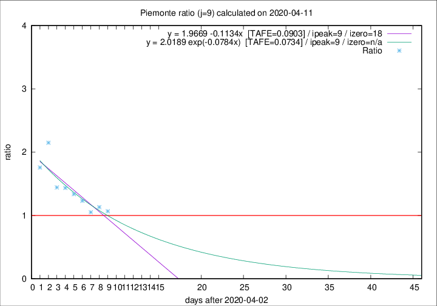

# Piemonte

Data source: https://raw.githubusercontent.com/pcm-dpc/COVID-19/master/dati-json/dpc-covid19-ita-regioni.json

Delta days analysis (j): 9

Analyses for other values of j for 2020-04-11 are avalable [here](../2020-04-11/README.md)

Analyses for Piemonte for previous dates are avalable [here](../README.md)

## Fitting 
|fit type|best fit equation|tafe|tfe|ipeak|izero|
|-------|-----|--------|------|---|---|
|linear|y = 1.9669 -0.1134x  [TAFE=0.0903]|0.0903|0.0087|9|18|
|exp|y = 2.0189 exp(-0.0784x)  [TAFE=0.0734]|0.0734|0.0046|9|n/a|

## Data
|Date|Daily deaths|Cumulated deaths|Deaths in the last 9 days|Deaths in the 9 days before|ratio|
|----|----------|-----------|-------|--------------------|-----|
|2020-04-11|101|1633|650|609|1.0673|
|2020-04-10|78|1532|646|571|1.1313|
|2020-04-09|76|1454|600|571|1.0508|
|2020-04-08|59|1378|629|511|1.2309|
|2020-04-07|68|1319|635|475|1.3368|
|2020-04-06|83|1251|634|442|1.4344|
|2020-04-05|40|1168|599|415|1.4434|
|2020-04-04|85|1128|679|316|2.1487|
|2020-04-03|60|1043|594|338|1.7574|

[Download data as CSV](COVID-19_piemonte_j9_2020-04-11.csv)

Generated April 14th, 2020 at 19:16:04 UTC+0200 with https://github.com/robianc/COVID-19
