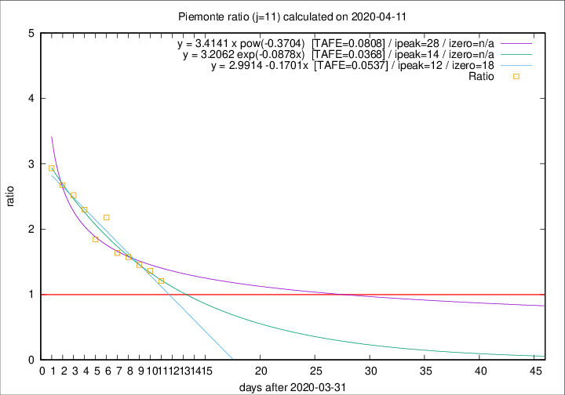

# Piemonte

Data source: https://raw.githubusercontent.com/pcm-dpc/COVID-19/master/dati-json/dpc-covid19-ita-regioni.json

Estimates in this page were made on 14/4/2020 with data available until 11/04/2020.

## Summary 

### Peak estimate 
|j|linear [TAFE]|exponential [TAFE]|power law [TAFE]|details|
|---|----|-----------|---------|-------|
|7|11/4/2020 [TAFE=0.0720]|11/4/2020 [TAFE=0.0719]|11/4/2020 [TAFE=0.0625]|[analysis](COVID-19_piemonte_j7_2020-04-11.md)|
|8|12/4/2020 [TAFE=0.0396]|12/4/2020 [TAFE=0.0386]|13/4/2020 [TAFE=0.0480]|[analysis](COVID-19_piemonte_j8_2020-04-11.md)|
|9|12/4/2020 [TAFE=0.0903]|12/4/2020 [TAFE=0.0734]|16/4/2020 [TAFE=0.0715]|[analysis](COVID-19_piemonte_j9_2020-04-11.md)|
|10|13/4/2020 [TAFE=0.0771]|14/4/2020 [TAFE=0.0627]|21/4/2020 [TAFE=0.0546]|[analysis](COVID-19_piemonte_j10_2020-04-11.md)|
|11|13/4/2020 [TAFE=0.0537]|15/4/2020 [TAFE=0.0368]|29/4/2020 [TAFE=0.0808]|[analysis](COVID-19_piemonte_j11_2020-04-11.md)|
|12|13/4/2020 [TAFE=0.0767]|16/4/2020 [TAFE=0.0535]|9/5/2020 [TAFE=0.0949]|[analysis](COVID-19_piemonte_j12_2020-04-11.md)|
|13|14/4/2020 [TAFE=0.0654]|17/4/2020 [TAFE=0.0458]|24/5/2020 [TAFE=0.1310]|[analysis](COVID-19_piemonte_j13_2020-04-11.md)|
|14|13/4/2020 [TAFE=0.0925]|18/4/2020 [TAFE=0.0491]|29/5/2020 [TAFE=0.1248]|[analysis](COVID-19_piemonte_j14_2020-04-11.md)|

Best estimator is exp with j=11 (TAFE=0.0368)
Corresponding peak date estimate is 15/4/2020 (ipeak 14)

Peak date range estimate: 7/4/2020 - 1/6/2020

### End estimate 
|j|linear [TAFE/TFE]|exponential [TAFE/TFE]|power law [TAFE/TFE]|details|
|---|----|-----------|---------|-------|
|7|9/5/2020 [TAFE=0.0720]|-|-|[analysis](COVID-19_piemonte_j7_2020-04-11.md)|
|8|27/4/2020 [TAFE=0.0396]|-|-|[analysis](COVID-19_piemonte_j8_2020-04-11.md)|
|9|-|-|-|[analysis](COVID-19_piemonte_j9_2020-04-11.md)|
|10|-|-|-|[analysis](COVID-19_piemonte_j10_2020-04-11.md)|
|11|-|-|-|[analysis](COVID-19_piemonte_j11_2020-04-11.md)|
|12|-|-|-|[analysis](COVID-19_piemonte_j12_2020-04-11.md)|
|13|-|-|-|[analysis](COVID-19_piemonte_j13_2020-04-11.md)|
|14|-|-|-|[analysis](COVID-19_piemonte_j14_2020-04-11.md)|

Best estimator is linear with j=8 (TAFE=0.0396)
Corresponding end date estimate is 27/4/2020 (izero 23)

End date range estimate: 4/4/2020 - 8/5/2020

Generated April 14th, 2020 at 19:16:04 UTC+0200 with https://github.com/robianc/COVID-19
