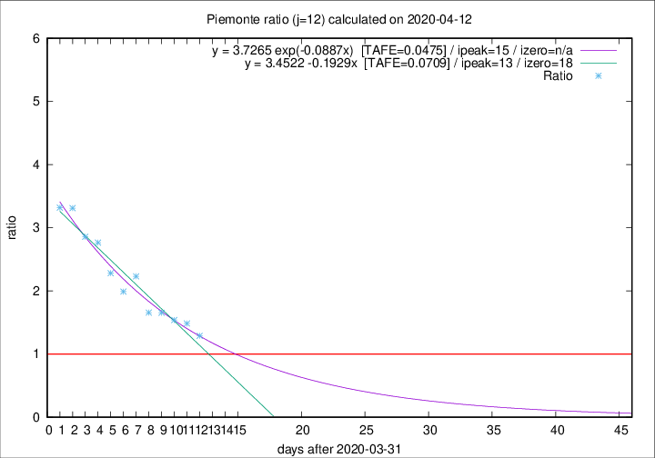

# Piemonte

Data source: https://raw.githubusercontent.com/pcm-dpc/COVID-19/master/dati-json/dpc-covid19-ita-regioni.json

Delta days analysis (j): 12

Analyses for other values of j for 2020-04-12 are avalable [here](../2020-04-12/README.md)

Analyses for Piemonte for previous dates are avalable [here](../README.md)

## Fitting 
|fit type|best fit equation|tafe|tfe|ipeak|izero|
|-------|-----|--------|------|---|---|
|linear|y = 3.4522 -0.1929x  [TAFE=0.0709]|0.0709|0.0021|13|18|
|exp|y = 3.7265 exp(-0.0887x)  [TAFE=0.0475]|0.0475|0.0017|15|n/a|

## Data
|Date|Daily deaths|Cumulated deaths|Deaths in the last 12 days|Deaths in the 12 days before|ratio|
|----|----------|-----------|-------|--------------------|-----|
|2020-04-12|96|1729|875|679|1.2887|
|2020-04-11|101|1633|884|595|1.4857|
|2020-04-10|78|1532|848|551|1.5390|
|2020-04-09|76|1454|837|506|1.6542|
|2020-04-08|59|1378|809|488|1.6578|
|2020-04-07|68|1319|870|390|2.2308|
|2020-04-06|83|1251|802|403|1.9901|
|2020-04-05|40|1168|794|348|2.2816|
|2020-04-04|85|1128|813|294|2.7653|
|2020-04-03|60|1043|760|266|2.8571|
|2020-04-02|97|983|745|225|3.3111|
|2020-04-01|32|886|677|204|3.3186|

[Download data as CSV](COVID-19_piemonte_j12_2020-04-12.csv)

Generated April 19th, 2020 at 18:42:39 UTC+0200 with https://github.com/robianc/COVID-19
