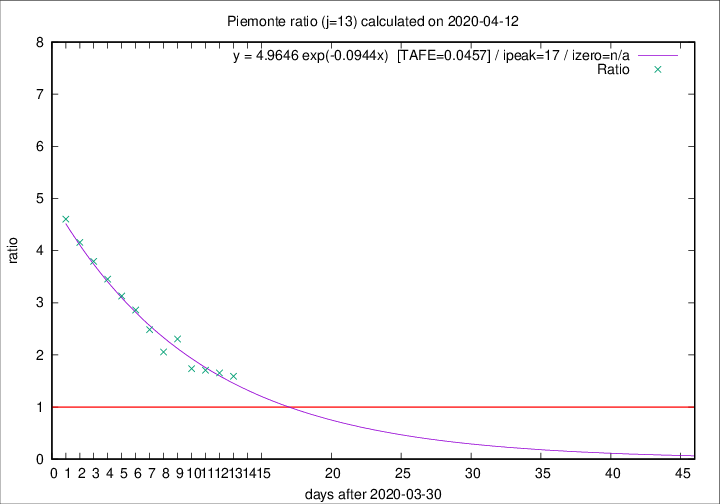

# Piemonte

Data source: https://raw.githubusercontent.com/pcm-dpc/COVID-19/master/dati-json/dpc-covid19-ita-regioni.json

Delta days analysis (j): 13

Analyses for other values of j for 2020-04-12 are avalable [here](../2020-04-12/README.md)

Analyses for Piemonte for previous dates are avalable [here](../README.md)

## Fitting 
|fit type|best fit equation|tafe|tfe|ipeak|izero|
|-------|-----|--------|------|---|---|
|exp|y = 4.9646 exp(-0.0944x)  [TAFE=0.0457]|0.0457|0.0019|17|n/a|

## Data
|Date|Daily deaths|Cumulated deaths|Deaths in the last 13 days|Deaths in the 13 days before|ratio|
|----|----------|-----------|-------|--------------------|-----|
|2020-04-12|96|1729|980|616|1.5909|
|2020-04-11|101|1633|949|573|1.6562|
|2020-04-10|78|1532|915|536|1.7071|
|2020-04-09|76|1454|885|510|1.7353|
|2020-04-08|59|1378|929|403|2.3052|
|2020-04-07|68|1319|870|423|2.0567|
|2020-04-06|83|1251|877|353|2.4844|
|2020-04-05|40|1168|853|298|2.8624|
|2020-04-04|85|1128|845|270|3.1296|
|2020-04-03|60|1043|805|233|3.4549|
|2020-04-02|97|983|774|204|3.7941|
|2020-04-01|32|886|711|171|4.1579|
|2020-03-31|105|854|700|152|4.6053|

[Download data as CSV](COVID-19_piemonte_j13_2020-04-12.csv)

Generated April 16th, 2020 at 20:09:19 UTC+0200 with https://github.com/robianc/COVID-19
