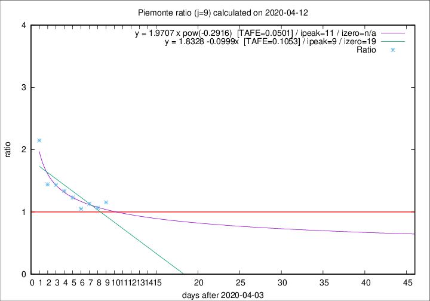

# Piemonte

Data source: https://raw.githubusercontent.com/pcm-dpc/COVID-19/master/dati-json/dpc-covid19-ita-regioni.json

Delta days analysis (j): 9

Analyses for other values of j for 2020-04-12 are avalable [here](../README.md)

Analyses for Piemonte for previous dates are avalable [here](../../README.md)

## Fitting 
|fit type|best fit equation|tafe|tfe|ipeak|izero|
|-------|-----|--------|------|---|---|
|linear|y = 1.8328 -0.0999x  [TAFE=0.1053]|0.1053|0.0127|9|19|
|pow|y = 1.9707 x pow(-0.2916)  [TAFE=0.0501]|0.0501|0.0023|11|n/a|

## Data
|Date|Daily deaths|Cumulated deaths|Deaths in the last 9 days|Deaths in the 9 days before|ratio|
|----|----------|-----------|-------|--------------------|-----|
|2020-04-12|96|1729|686|594|1.1549|
|2020-04-11|101|1633|650|609|1.0673|
|2020-04-10|78|1532|646|571|1.1313|
|2020-04-09|76|1454|600|571|1.0508|
|2020-04-08|59|1378|629|511|1.2309|
|2020-04-07|68|1319|635|475|1.3368|
|2020-04-06|83|1251|634|442|1.4344|
|2020-04-05|40|1168|599|415|1.4434|
|2020-04-04|85|1128|679|316|2.1487|

[Download data as CSV](COVID-19_piemonte_j9_2020-04-12.csv)

Generated April 12th, 2020 at 16:28:18 UTC+0200 with https://github.com/robianc/COVID-19
