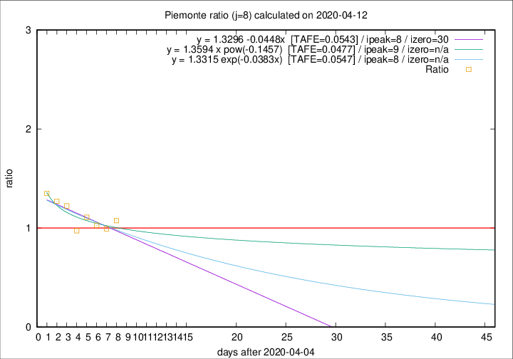

# Piemonte

Data source: https://raw.githubusercontent.com/pcm-dpc/COVID-19/master/dati-json/dpc-covid19-ita-regioni.json

Estimates in this page were made on 19/4/2020 with data available until 12/04/2020.

## Summary 

### Peak estimate 
|j|linear [TAFE]|exponential [TAFE]|power law [TAFE]|details|
|---|----|-----------|---------|-------|
|7|7/5/2020 [TAFE=0.0853]|6/5/2020 [TAFE=0.0842]|19/4/2020 [TAFE=0.0807]|[analysis](COVID-19_piemonte_j7_2020-04-12.md)|
|8|13/4/2020 [TAFE=0.0543]|13/4/2020 [TAFE=0.0547]|14/4/2020 [TAFE=0.0477]|[analysis](COVID-19_piemonte_j8_2020-04-12.md)|
|9|13/4/2020 [TAFE=0.1053]|13/4/2020 [TAFE=0.0846]|15/4/2020 [TAFE=0.0501]|[analysis](COVID-19_piemonte_j9_2020-04-12.md)|
|10|14/4/2020 [TAFE=0.0803]|14/4/2020 [TAFE=0.0625]|20/4/2020 [TAFE=0.0624]|[analysis](COVID-19_piemonte_j10_2020-04-12.md)|
|11|14/4/2020 [TAFE=0.0697]|15/4/2020 [TAFE=0.0560]|27/4/2020 [TAFE=0.0673]|[analysis](COVID-19_piemonte_j11_2020-04-12.md)|
|12|14/4/2020 [TAFE=0.0709]|16/4/2020 [TAFE=0.0475]|5/5/2020 [TAFE=0.0931]|[analysis](COVID-19_piemonte_j12_2020-04-12.md)|
|13|14/4/2020 [TAFE=0.0813]|17/4/2020 [TAFE=0.0457]|14/5/2020 [TAFE=0.1070]|[analysis](COVID-19_piemonte_j13_2020-04-12.md)|
|14|14/4/2020 [TAFE=0.0786]|18/4/2020 [TAFE=0.0441]|28/5/2020 [TAFE=0.1333]|[analysis](COVID-19_piemonte_j14_2020-04-12.md)|

Best estimator is exp with j=14 (TAFE=0.0441)
Corresponding peak date estimate is 18/4/2020 (ipeak 19)

Peak date range estimate: 7/4/2020 - 28/5/2020

### End estimate 
|j|linear [TAFE/TFE]|exponential [TAFE/TFE]|power law [TAFE/TFE]|details|
|---|----|-----------|---------|-------|
|7|-|-|-|[analysis](COVID-19_piemonte_j7_2020-04-12.md)|
|8|5/5/2020 [TAFE=0.0543]|-|-|[analysis](COVID-19_piemonte_j8_2020-04-12.md)|
|9|-|-|-|[analysis](COVID-19_piemonte_j9_2020-04-12.md)|
|10|-|-|-|[analysis](COVID-19_piemonte_j10_2020-04-12.md)|
|11|-|-|-|[analysis](COVID-19_piemonte_j11_2020-04-12.md)|
|12|-|-|-|[analysis](COVID-19_piemonte_j12_2020-04-12.md)|
|13|-|-|-|[analysis](COVID-19_piemonte_j13_2020-04-12.md)|
|14|-|-|-|[analysis](COVID-19_piemonte_j14_2020-04-12.md)|

Best estimator is linear with j=8 (TAFE=0.0543)
Corresponding end date estimate is 5/5/2020 (izero 30)

End date range estimate: 5/4/2020 - 5/5/2020

Generated April 19th, 2020 at 18:42:39 UTC+0200 with https://github.com/robianc/COVID-19
