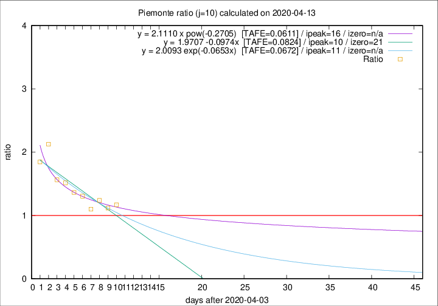

# Piemonte

Data source: https://raw.githubusercontent.com/pcm-dpc/COVID-19/master/dati-json/dpc-covid19-ita-regioni.json

Delta days analysis (j): 10

Analyses for other values of j for 2020-04-13 are avalable [here](../2020-04-13/README.md)

Analyses for Piemonte for previous dates are avalable [here](../README.md)

## Fitting 
|fit type|best fit equation|tafe|tfe|ipeak|izero|
|-------|-----|--------|------|---|---|
|linear|y = 1.9707 -0.0974x  [TAFE=0.0824]|0.0824|0.0080|10|21|
|exp|y = 2.0093 exp(-0.0653x)  [TAFE=0.0672]|0.0672|0.0040|11|n/a|
|pow|y = 2.1110 x pow(-0.2705)  [TAFE=0.0611]|0.0611|0.0039|16|n/a|

## Data
|Date|Daily deaths|Cumulated deaths|Deaths in the last 10 days|Deaths in the 10 days before|ratio|
|----|----------|-----------|-------|--------------------|-----|
|2020-04-13|97|1826|783|669|1.1704|
|2020-04-12|96|1729|746|668|1.1168|
|2020-04-11|101|1633|747|603|1.2388|
|2020-04-10|78|1532|678|616|1.1006|
|2020-04-09|76|1454|705|540|1.3056|
|2020-04-08|59|1378|694|509|1.3635|
|2020-04-07|68|1319|702|463|1.5162|
|2020-04-06|83|1251|682|436|1.5642|
|2020-04-05|40|1168|719|338|2.1272|
|2020-04-04|85|1128|679|368|1.8451|

[Download data as CSV](COVID-19_piemonte_j10_2020-04-13.csv)

Generated April 14th, 2020 at 19:16:04 UTC+0200 with https://github.com/robianc/COVID-19
