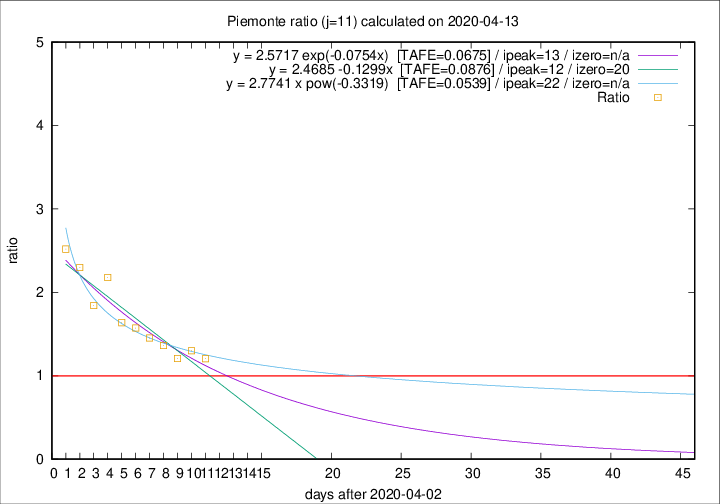

# Piemonte

Data source: https://raw.githubusercontent.com/pcm-dpc/COVID-19/master/dati-json/dpc-covid19-ita-regioni.json

Delta days analysis (j): 11

Analyses for other values of j for 2020-04-13 are avalable [here](../2020-04-13/README.md)

Analyses for Piemonte for previous dates are avalable [here](../README.md)

## Fitting 
|fit type|best fit equation|tafe|tfe|ipeak|izero|
|-------|-----|--------|------|---|---|
|linear|y = 2.4685 -0.1299x  [TAFE=0.0876]|0.0876|0.0050|12|20|
|exp|y = 2.5717 exp(-0.0754x)  [TAFE=0.0675]|0.0675|0.0027|13|n/a|
|pow|y = 2.7741 x pow(-0.3319)  [TAFE=0.0539]|0.0539|0.0033|22|n/a|

## Data
|Date|Daily deaths|Cumulated deaths|Deaths in the last 11 days|Deaths in the 11 days before|ratio|
|----|----------|-----------|-------|--------------------|-----|
|2020-04-13|97|1826|843|700|1.2043|
|2020-04-12|96|1729|843|648|1.3009|
|2020-04-11|101|1633|779|645|1.2078|
|2020-04-10|78|1532|783|574|1.3641|
|2020-04-09|76|1454|770|530|1.4528|
|2020-04-08|59|1378|761|484|1.5723|
|2020-04-07|68|1319|750|458|1.6376|
|2020-04-06|83|1251|802|368|2.1793|
|2020-04-05|40|1168|719|390|1.8436|
|2020-04-04|85|1128|754|328|2.2988|
|2020-04-03|60|1043|728|289|2.5190|

[Download data as CSV](COVID-19_piemonte_j11_2020-04-13.csv)

Generated April 19th, 2020 at 18:42:39 UTC+0200 with https://github.com/robianc/COVID-19
