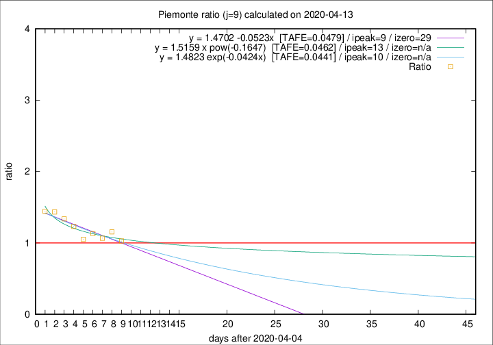

# Piemonte

Data source: https://raw.githubusercontent.com/pcm-dpc/COVID-19/master/dati-json/dpc-covid19-ita-regioni.json

Estimates in this page were made on 19/4/2020 with data available until 13/04/2020.

## Summary 

### Peak estimate 
|j|linear [TAFE]|exponential [TAFE]|power law [TAFE]|details|
|---|----|-----------|---------|-------|
|7|9/4/2020 [TAFE=0.0637]|9/4/2020 [TAFE=0.0631]|9/4/2020 [TAFE=0.0713]|[analysis](COVID-19_piemonte_j7_2020-04-13.md)|
|8|18/4/2020 [TAFE=0.0754]|19/4/2020 [TAFE=0.0747]|21/4/2020 [TAFE=0.0667]|[analysis](COVID-19_piemonte_j8_2020-04-13.md)|
|9|14/4/2020 [TAFE=0.0479]|15/4/2020 [TAFE=0.0441]|18/4/2020 [TAFE=0.0462]|[analysis](COVID-19_piemonte_j9_2020-04-13.md)|
|10|14/4/2020 [TAFE=0.0824]|15/4/2020 [TAFE=0.0672]|20/4/2020 [TAFE=0.0611]|[analysis](COVID-19_piemonte_j10_2020-04-13.md)|
|11|15/4/2020 [TAFE=0.0876]|16/4/2020 [TAFE=0.0675]|25/4/2020 [TAFE=0.0539]|[analysis](COVID-19_piemonte_j11_2020-04-13.md)|
|12|15/4/2020 [TAFE=0.0844]|17/4/2020 [TAFE=0.0625]|1/5/2020 [TAFE=0.0598]|[analysis](COVID-19_piemonte_j12_2020-04-13.md)|
|13|15/4/2020 [TAFE=0.0862]|18/4/2020 [TAFE=0.0486]|9/5/2020 [TAFE=0.0967]|[analysis](COVID-19_piemonte_j13_2020-04-13.md)|
|14|15/4/2020 [TAFE=0.0892]|19/4/2020 [TAFE=0.0495]|21/5/2020 [TAFE=0.1242]|[analysis](COVID-19_piemonte_j14_2020-04-13.md)|

Best estimator is exp with j=9 (TAFE=0.0441)
Corresponding peak date estimate is 15/4/2020 (ipeak 10)

Peak date range estimate: 7/4/2020 - 26/5/2020

### End estimate 
|j|linear [TAFE/TFE]|exponential [TAFE/TFE]|power law [TAFE/TFE]|details|
|---|----|-----------|---------|-------|
|7|-|-|-|[analysis](COVID-19_piemonte_j7_2020-04-13.md)|
|8|21/6/2020 [TAFE=0.0754]|-|-|[analysis](COVID-19_piemonte_j8_2020-04-13.md)|
|9|4/5/2020 [TAFE=0.0479]|-|-|[analysis](COVID-19_piemonte_j9_2020-04-13.md)|
|10|-|-|-|[analysis](COVID-19_piemonte_j10_2020-04-13.md)|
|11|-|-|-|[analysis](COVID-19_piemonte_j11_2020-04-13.md)|
|12|-|-|-|[analysis](COVID-19_piemonte_j12_2020-04-13.md)|
|13|-|-|-|[analysis](COVID-19_piemonte_j13_2020-04-13.md)|
|14|-|-|-|[analysis](COVID-19_piemonte_j14_2020-04-13.md)|

Best estimator is linear with j=9 (TAFE=0.0479)
Corresponding end date estimate is 4/5/2020 (izero 29)

End date range estimate: 5/4/2020 - 20/6/2020

Generated April 19th, 2020 at 18:42:39 UTC+0200 with https://github.com/robianc/COVID-19
