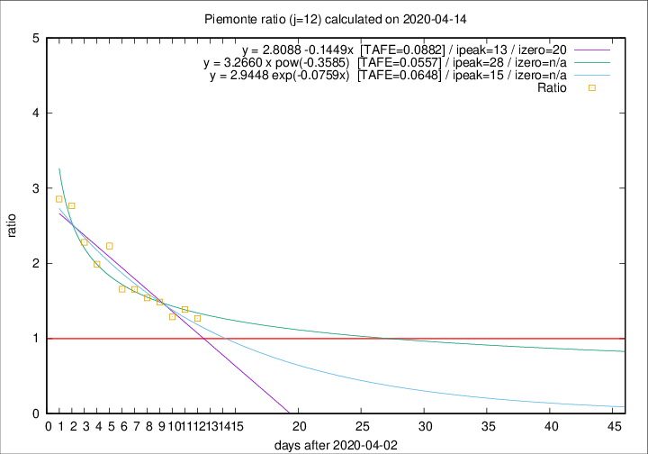

# Piemonte

Data source: https://raw.githubusercontent.com/pcm-dpc/COVID-19/master/dati-json/dpc-covid19-ita-regioni.json

Delta days analysis (j): 12

Analyses for other values of j for 2020-04-14 are avalable [here](../2020-04-14/README.md)

Analyses for Piemonte for previous dates are avalable [here](../README.md)

## Fitting 
|fit type|best fit equation|tafe|tfe|ipeak|izero|
|-------|-----|--------|------|---|---|
|linear|y = 2.8088 -0.1449x  [TAFE=0.0882]|0.0882|0.0044|13|20|
|exp|y = 2.9448 exp(-0.0759x)  [TAFE=0.0648]|0.0648|0.0029|15|n/a|
|pow|y = 3.2660 x pow(-0.3585)  [TAFE=0.0557]|0.0557|0.0033|28|n/a|

## Data
|Date|Daily deaths|Cumulated deaths|Deaths in the last 12 days|Deaths in the 12 days before|ratio|
|----|----------|-----------|-------|--------------------|-----|
|2020-04-14|101|1927|944|745|1.2671|
|2020-04-13|97|1826|940|677|1.3885|
|2020-04-12|96|1729|875|679|1.2887|
|2020-04-11|101|1633|884|595|1.4857|
|2020-04-10|78|1532|848|551|1.5390|
|2020-04-09|76|1454|837|506|1.6542|
|2020-04-08|59|1378|809|488|1.6578|
|2020-04-07|68|1319|870|390|2.2308|
|2020-04-06|83|1251|802|403|1.9901|
|2020-04-05|40|1168|794|348|2.2816|
|2020-04-04|85|1128|813|294|2.7653|
|2020-04-03|60|1043|760|266|2.8571|

[Download data as CSV](COVID-19_piemonte_j12_2020-04-14.csv)

Generated April 14th, 2020 at 19:16:04 UTC+0200 with https://github.com/robianc/COVID-19
