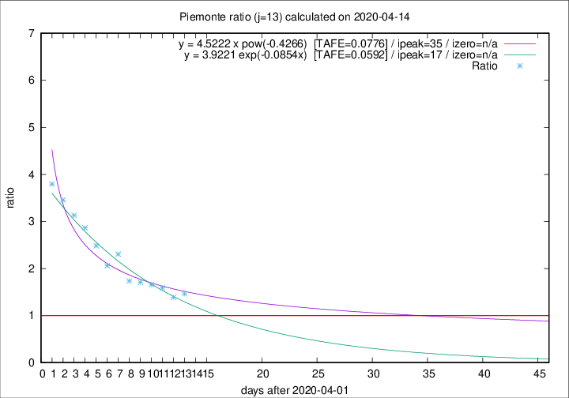

# Piemonte

Data source: https://raw.githubusercontent.com/pcm-dpc/COVID-19/master/dati-json/dpc-covid19-ita-regioni.json

Delta days analysis (j): 13

Analyses for other values of j for 2020-04-14 are avalable [here](../2020-04-14/README.md)

Analyses for Piemonte for previous dates are avalable [here](../README.md)

## Fitting 
|fit type|best fit equation|tafe|tfe|ipeak|izero|
|-------|-----|--------|------|---|---|
|exp|y = 3.9221 exp(-0.0854x)  [TAFE=0.0592]|0.0592|0.0025|17|n/a|
|pow|y = 4.5222 x pow(-0.4266)  [TAFE=0.0776]|0.0776|0.0044|35|n/a|

## Data
|Date|Daily deaths|Cumulated deaths|Deaths in the last 13 days|Deaths in the 13 days before|ratio|
|----|----------|-----------|-------|--------------------|-----|
|2020-04-14|101|1927|1041|711|1.4641|
|2020-04-13|97|1826|972|700|1.3886|
|2020-04-12|96|1729|980|616|1.5909|
|2020-04-11|101|1633|949|573|1.6562|
|2020-04-10|78|1532|915|536|1.7071|
|2020-04-09|76|1454|885|510|1.7353|
|2020-04-08|59|1378|929|403|2.3052|
|2020-04-07|68|1319|870|423|2.0567|
|2020-04-06|83|1251|877|353|2.4844|
|2020-04-05|40|1168|853|298|2.8624|
|2020-04-04|85|1128|845|270|3.1296|
|2020-04-03|60|1043|805|233|3.4549|
|2020-04-02|97|983|774|204|3.7941|

[Download data as CSV](COVID-19_piemonte_j13_2020-04-14.csv)

Generated April 19th, 2020 at 18:42:39 UTC+0200 with https://github.com/robianc/COVID-19
