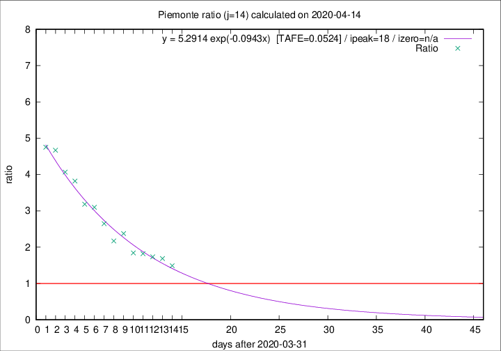

# Piemonte

Data source: https://raw.githubusercontent.com/pcm-dpc/COVID-19/master/dati-json/dpc-covid19-ita-regioni.json

Delta days analysis (j): 14

Analyses for other values of j for 2020-04-14 are avalable [here](../2020-04-14/README.md)

Analyses for Piemonte for previous dates are avalable [here](../README.md)

## Fitting 
|fit type|best fit equation|tafe|tfe|ipeak|izero|
|-------|-----|--------|------|---|---|
|exp|y = 5.2914 exp(-0.0943x)  [TAFE=0.0524]|0.0524|0.0017|18|n/a|

## Data
|Date|Daily deaths|Cumulated deaths|Deaths in the last 14 days|Deaths in the 14 days before|ratio|
|----|----------|-----------|-------|--------------------|-----|
|2020-04-14|101|1927|1073|721|1.4882|
|2020-04-13|97|1826|1077|638|1.6881|
|2020-04-12|96|1729|1045|603|1.7330|
|2020-04-11|101|1633|1016|558|1.8208|
|2020-04-10|78|1532|963|523|1.8413|
|2020-04-09|76|1454|1005|423|2.3759|
|2020-04-08|59|1378|929|428|2.1706|
|2020-04-07|68|1319|945|357|2.6471|
|2020-04-06|83|1251|936|302|3.0993|
|2020-04-05|40|1168|885|278|3.1835|
|2020-04-04|85|1128|890|233|3.8197|
|2020-04-03|60|1043|834|205|4.0683|
|2020-04-02|97|983|808|173|4.6705|
|2020-04-01|32|886|732|154|4.7532|

[Download data as CSV](COVID-19_piemonte_j14_2020-04-14.csv)

Generated April 14th, 2020 at 19:16:04 UTC+0200 with https://github.com/robianc/COVID-19
