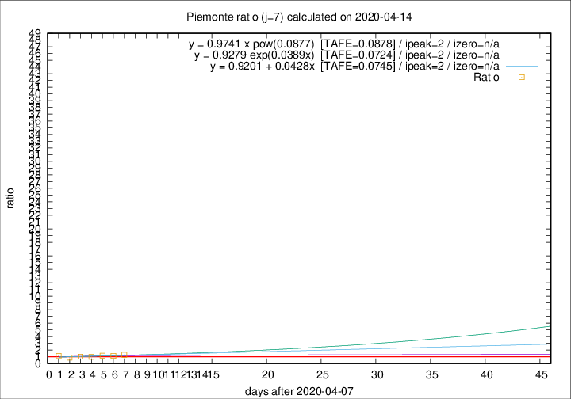

# Piemonte

Data source: https://raw.githubusercontent.com/pcm-dpc/COVID-19/master/dati-json/dpc-covid19-ita-regioni.json

Delta days analysis (j): 7

Analyses for other values of j for 2020-04-14 are avalable [here](../2020-04-14/README.md)

Analyses for Piemonte for previous dates are avalable [here](../README.md)

## Fitting 
|fit type|best fit equation|tafe|tfe|ipeak|izero|
|-------|-----|--------|------|---|---|
|linear|y = 0.9201 + 0.0428x  [TAFE=0.0745]|0.0745|0.0078|2|n/a|
|exp|y = 0.9279 exp(0.0389x)  [TAFE=0.0724]|0.0724|0.0041|2|n/a|
|pow|y = 0.9741 x pow(0.0877)  [TAFE=0.0878]|0.0878|0.0055|2|n/a|

## Data
|Date|Daily deaths|Cumulated deaths|Deaths in the last 7 days|Deaths in the 7 days before|ratio|
|----|----------|-----------|-------|--------------------|-----|
|2020-04-14|101|1927|608|465|1.3075|
|2020-04-13|97|1826|575|502|1.1454|
|2020-04-12|96|1729|561|484|1.1591|
|2020-04-11|101|1633|505|511|0.9883|
|2020-04-10|78|1532|489|474|1.0316|
|2020-04-09|76|1454|471|534|0.8820|
|2020-04-08|59|1378|492|437|1.1259|

[Download data as CSV](COVID-19_piemonte_j7_2020-04-14.csv)

Generated April 14th, 2020 at 19:16:04 UTC+0200 with https://github.com/robianc/COVID-19
