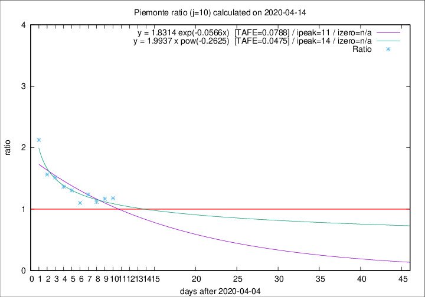
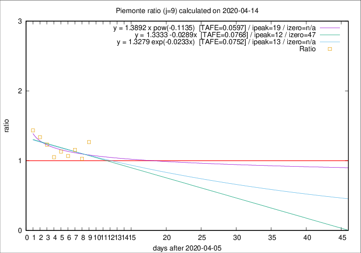

# Piemonte

Data source: https://raw.githubusercontent.com/pcm-dpc/COVID-19/master/dati-json/dpc-covid19-ita-regioni.json

Estimates in this page were made on 14/4/2020 with data available until 14/04/2020.

## Summary 

### Peak estimate 
|j|linear [TAFE]|exponential [TAFE]|power law [TAFE]|details|
|---|----|-----------|---------|-------|
|7|10/4/2020 [TAFE=0.0745]|10/4/2020 [TAFE=0.0724]|10/4/2020 [TAFE=0.0878]|[analysis](COVID-19_piemonte_j7_2020-04-14.md)|
|8|-|-|-|[analysis](COVID-19_piemonte_j8_2020-04-14.md)|
|9|18/4/2020 [TAFE=0.0768]|19/4/2020 [TAFE=0.0752]|25/4/2020 [TAFE=0.0597]|[analysis](COVID-19_piemonte_j9_2020-04-14.md)|
|10|15/4/2020 [TAFE=0.0944]|16/4/2020 [TAFE=0.0788]|19/4/2020 [TAFE=0.0475]|[analysis](COVID-19_piemonte_j10_2020-04-14.md)|
|11|16/4/2020 [TAFE=0.0878]|17/4/2020 [TAFE=0.0698]|26/4/2020 [TAFE=0.0487]|[analysis](COVID-19_piemonte_j11_2020-04-14.md)|
|12|16/4/2020 [TAFE=0.0882]|18/4/2020 [TAFE=0.0648]|1/5/2020 [TAFE=0.0557]|[analysis](COVID-19_piemonte_j12_2020-04-14.md)|
|13|16/4/2020 [TAFE=0.0896]|19/4/2020 [TAFE=0.0592]|7/5/2020 [TAFE=0.0776]|[analysis](COVID-19_piemonte_j13_2020-04-14.md)|
|14|16/4/2020 [TAFE=0.0990]|19/4/2020 [TAFE=0.0524]|15/5/2020 [TAFE=0.1138]|[analysis](COVID-19_piemonte_j14_2020-04-14.md)|

Best estimator is pow with j=10 (TAFE=0.0475)
Corresponding peak date estimate is 19/4/2020 (ipeak 14)

Peak date range estimate: 5/4/2020 - 19/5/2020

### End estimate 
|j|linear [TAFE/TFE]|exponential [TAFE/TFE]|power law [TAFE/TFE]|details|
|---|----|-----------|---------|-------|
|7|-|-|-|[analysis](COVID-19_piemonte_j7_2020-04-14.md)|
|8|-|-|-|[analysis](COVID-19_piemonte_j8_2020-04-14.md)|
|9|23/5/2020 [TAFE=0.0768]|-|-|[analysis](COVID-19_piemonte_j9_2020-04-14.md)|
|10|-|-|-|[analysis](COVID-19_piemonte_j10_2020-04-14.md)|
|11|-|-|-|[analysis](COVID-19_piemonte_j11_2020-04-14.md)|
|12|-|-|-|[analysis](COVID-19_piemonte_j12_2020-04-14.md)|
|13|-|-|-|[analysis](COVID-19_piemonte_j13_2020-04-14.md)|
|14|-|-|-|[analysis](COVID-19_piemonte_j14_2020-04-14.md)|

Best estimator is linear with j=9 (TAFE=0.0768)
Corresponding end date estimate is 23/5/2020 (izero 47)

End date range estimate: 6/4/2020 - 23/5/2020

Generated April 14th, 2020 at 19:16:04 UTC+0200 with https://github.com/robianc/COVID-19
