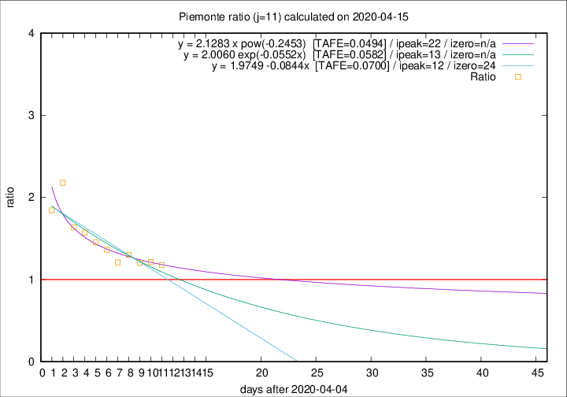

# Piemonte

Data source: https://raw.githubusercontent.com/pcm-dpc/COVID-19/master/dati-json/dpc-covid19-ita-regioni.json

Delta days analysis (j): 11

Analyses for other values of j for 2020-04-15 are avalable [here](../2020-04-15/README.md)

Analyses for Piemonte for previous dates are avalable [here](../README.md)

## Fitting 
|fit type|best fit equation|tafe|tfe|ipeak|izero|
|-------|-----|--------|------|---|---|
|linear|y = 1.9749 -0.0844x  [TAFE=0.0700]|0.0700|0.0061|12|24|
|exp|y = 2.0060 exp(-0.0552x)  [TAFE=0.0582]|0.0582|0.0030|13|n/a|
|pow|y = 2.1283 x pow(-0.2453)  [TAFE=0.0494]|0.0494|0.0031|22|n/a|

## Data
|Date|Daily deaths|Cumulated deaths|Deaths in the last 11 days|Deaths in the 11 days before|ratio|
|----|----------|-----------|-------|--------------------|-----|
|2020-04-15|88|2015|887|754|1.1764|
|2020-04-14|101|1927|884|728|1.2143|
|2020-04-13|97|1826|843|700|1.2043|
|2020-04-12|96|1729|843|648|1.3009|
|2020-04-11|101|1633|779|645|1.2078|
|2020-04-10|78|1532|783|574|1.3641|
|2020-04-09|76|1454|770|530|1.4528|
|2020-04-08|59|1378|761|484|1.5723|
|2020-04-07|68|1319|750|458|1.6376|
|2020-04-06|83|1251|802|368|2.1793|
|2020-04-05|40|1168|719|390|1.8436|

[Download data as CSV](COVID-19_piemonte_j11_2020-04-15.csv)

Generated April 16th, 2020 at 20:09:19 UTC+0200 with https://github.com/robianc/COVID-19
