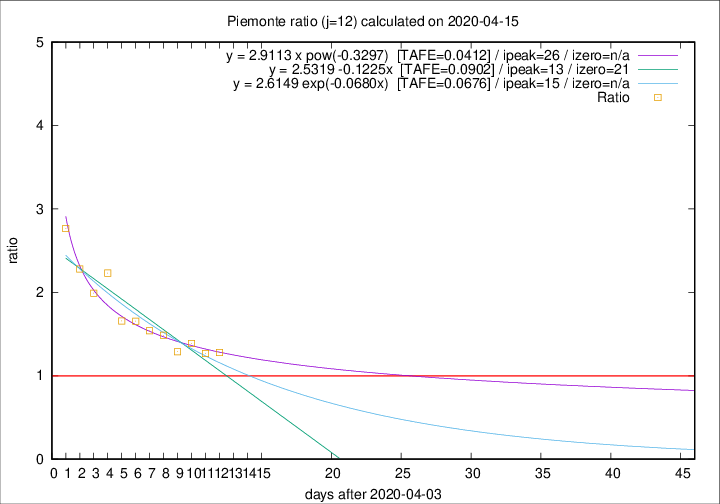

# Piemonte

Data source: https://raw.githubusercontent.com/pcm-dpc/COVID-19/master/dati-json/dpc-covid19-ita-regioni.json

Delta days analysis (j): 12

Analyses for other values of j for 2020-04-15 are avalable [here](../2020-04-15/README.md)

Analyses for Piemonte for previous dates are avalable [here](../README.md)

## Fitting 
|fit type|best fit equation|tafe|tfe|ipeak|izero|
|-------|-----|--------|------|---|---|
|linear|y = 2.5319 -0.1225x  [TAFE=0.0902]|0.0902|0.0057|13|21|
|exp|y = 2.6149 exp(-0.0680x)  [TAFE=0.0676]|0.0676|0.0029|15|n/a|
|pow|y = 2.9113 x pow(-0.3297)  [TAFE=0.0412]|0.0412|0.0021|26|n/a|

## Data
|Date|Daily deaths|Cumulated deaths|Deaths in the last 12 days|Deaths in the 12 days before|ratio|
|----|----------|-----------|-------|--------------------|-----|
|2020-04-15|88|2015|972|760|1.2789|
|2020-04-14|101|1927|944|745|1.2671|
|2020-04-13|97|1826|940|677|1.3885|
|2020-04-12|96|1729|875|679|1.2887|
|2020-04-11|101|1633|884|595|1.4857|
|2020-04-10|78|1532|848|551|1.5390|
|2020-04-09|76|1454|837|506|1.6542|
|2020-04-08|59|1378|809|488|1.6578|
|2020-04-07|68|1319|870|390|2.2308|
|2020-04-06|83|1251|802|403|1.9901|
|2020-04-05|40|1168|794|348|2.2816|
|2020-04-04|85|1128|813|294|2.7653|

[Download data as CSV](COVID-19_piemonte_j12_2020-04-15.csv)

Generated April 16th, 2020 at 20:09:19 UTC+0200 with https://github.com/robianc/COVID-19
