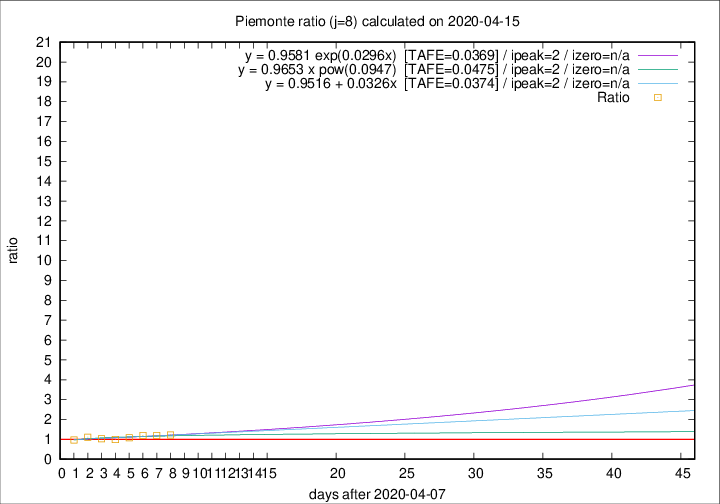

# Piemonte

Data source: https://raw.githubusercontent.com/pcm-dpc/COVID-19/master/dati-json/dpc-covid19-ita-regioni.json

Delta days analysis (j): 8

Analyses for other values of j for 2020-04-15 are avalable [here](../2020-04-15/README.md)

Analyses for Piemonte for previous dates are avalable [here](../README.md)

## Fitting 
|fit type|best fit equation|tafe|tfe|ipeak|izero|
|-------|-----|--------|------|---|---|
|linear|y = 0.9516 + 0.0326x  [TAFE=0.0374]|0.0374|0.0024|2|n/a|
|exp|y = 0.9581 exp(0.0296x)  [TAFE=0.0369]|0.0369|0.0013|2|n/a|
|pow|y = 0.9653 x pow(0.0947)  [TAFE=0.0475]|0.0475|0.0015|2|n/a|

## Data
|Date|Daily deaths|Cumulated deaths|Deaths in the last 8 days|Deaths in the 8 days before|ratio|
|----|----------|-----------|-------|--------------------|-----|
|2020-04-15|88|2015|696|570|1.2211|
|2020-04-14|101|1927|676|567|1.1922|
|2020-04-13|97|1826|658|551|1.1942|
|2020-04-12|96|1729|601|559|1.0751|
|2020-04-11|101|1633|590|594|0.9933|
|2020-04-10|78|1532|549|534|1.0281|
|2020-04-09|76|1454|568|512|1.1094|
|2020-04-08|59|1378|524|539|0.9722|

[Download data as CSV](COVID-19_piemonte_j8_2020-04-15.csv)

Generated April 16th, 2020 at 20:09:19 UTC+0200 with https://github.com/robianc/COVID-19
