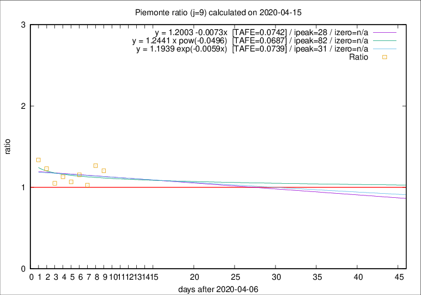

# Piemonte

Data source: https://raw.githubusercontent.com/pcm-dpc/COVID-19/master/dati-json/dpc-covid19-ita-regioni.json

Delta days analysis (j): 9

Analyses for other values of j for 2020-04-15 are avalable [here](../2020-04-15/README.md)

Analyses for Piemonte for previous dates are avalable [here](../README.md)

## Fitting 
|fit type|best fit equation|tafe|tfe|ipeak|izero|
|-------|-----|--------|------|---|---|
|linear|y = 1.2003 -0.0073x  [TAFE=0.0742]|0.0742|0.0072|28|n/a|
|exp|y = 1.1939 exp(-0.0059x)  [TAFE=0.0739]|0.0739|0.0033|31|n/a|
|pow|y = 1.2441 x pow(-0.0496)  [TAFE=0.0687]|0.0687|0.0030|82|n/a|

## Data
|Date|Daily deaths|Cumulated deaths|Deaths in the last 9 days|Deaths in the 9 days before|ratio|
|----|----------|-----------|-------|--------------------|-----|
|2020-04-15|88|2015|764|634|1.2050|
|2020-04-14|101|1927|759|599|1.2671|
|2020-04-13|97|1826|698|679|1.0280|
|2020-04-12|96|1729|686|594|1.1549|
|2020-04-11|101|1633|650|609|1.0673|
|2020-04-10|78|1532|646|571|1.1313|
|2020-04-09|76|1454|600|571|1.0508|
|2020-04-08|59|1378|629|511|1.2309|
|2020-04-07|68|1319|635|475|1.3368|

[Download data as CSV](COVID-19_piemonte_j9_2020-04-15.csv)

Generated April 19th, 2020 at 18:42:39 UTC+0200 with https://github.com/robianc/COVID-19
