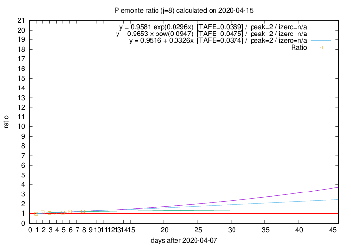

# Piemonte

Data source: https://raw.githubusercontent.com/pcm-dpc/COVID-19/master/dati-json/dpc-covid19-ita-regioni.json

Estimates in this page were made on 19/4/2020 with data available until 15/04/2020.

## Summary 

### Peak estimate 
|j|linear [TAFE]|exponential [TAFE]|power law [TAFE]|details|
|---|----|-----------|---------|-------|
|7|11/4/2020 [TAFE=0.0393]|11/4/2020 [TAFE=0.0414]|11/4/2020 [TAFE=0.0378]|[analysis](COVID-19_piemonte_j7_2020-04-15.md)|
|8|10/4/2020 [TAFE=0.0374]|10/4/2020 [TAFE=0.0369]|10/4/2020 [TAFE=0.0475]|[analysis](COVID-19_piemonte_j8_2020-04-15.md)|
|9|5/5/2020 [TAFE=0.0742]|8/5/2020 [TAFE=0.0739]|28/6/2020 [TAFE=0.0687]|[analysis](COVID-19_piemonte_j9_2020-04-15.md)|
|10|18/4/2020 [TAFE=0.0568]|19/4/2020 [TAFE=0.0523]|28/4/2020 [TAFE=0.0399]|[analysis](COVID-19_piemonte_j10_2020-04-15.md)|
|11|17/4/2020 [TAFE=0.0700]|18/4/2020 [TAFE=0.0582]|27/4/2020 [TAFE=0.0494]|[analysis](COVID-19_piemonte_j11_2020-04-15.md)|
|12|17/4/2020 [TAFE=0.0902]|19/4/2020 [TAFE=0.0676]|30/4/2020 [TAFE=0.0412]|[analysis](COVID-19_piemonte_j12_2020-04-15.md)|
|13|17/4/2020 [TAFE=0.0923]|19/4/2020 [TAFE=0.0656]|5/5/2020 [TAFE=0.0610]|[analysis](COVID-19_piemonte_j13_2020-04-15.md)|
|14|17/4/2020 [TAFE=0.1118]|20/4/2020 [TAFE=0.0616]|11/5/2020 [TAFE=0.0833]|[analysis](COVID-19_piemonte_j14_2020-04-15.md)|

Best estimator is exp with j=8 (TAFE=0.0369)
Corresponding peak date estimate is 10/4/2020 (ipeak 2)

Peak date range estimate: 10/4/2020 - 29/6/2020

### End estimate 
|j|linear [TAFE/TFE]|exponential [TAFE/TFE]|power law [TAFE/TFE]|details|
|---|----|-----------|---------|-------|
|7|-|-|-|[analysis](COVID-19_piemonte_j7_2020-04-15.md)|
|8|-|-|-|[analysis](COVID-19_piemonte_j8_2020-04-15.md)|
|9|-|-|-|[analysis](COVID-19_piemonte_j9_2020-04-15.md)|
|10|11/5/2020 [TAFE=0.0568]|-|-|[analysis](COVID-19_piemonte_j10_2020-04-15.md)|
|11|-|-|-|[analysis](COVID-19_piemonte_j11_2020-04-15.md)|
|12|-|-|-|[analysis](COVID-19_piemonte_j12_2020-04-15.md)|
|13|-|-|-|[analysis](COVID-19_piemonte_j13_2020-04-15.md)|
|14|-|-|-|[analysis](COVID-19_piemonte_j14_2020-04-15.md)|

Best estimator is linear with j=10 (TAFE=0.0568)
Corresponding end date estimate is 11/5/2020 (izero 35)

End date range estimate: 6/4/2020 - 11/5/2020

Generated April 19th, 2020 at 18:42:39 UTC+0200 with https://github.com/robianc/COVID-19
